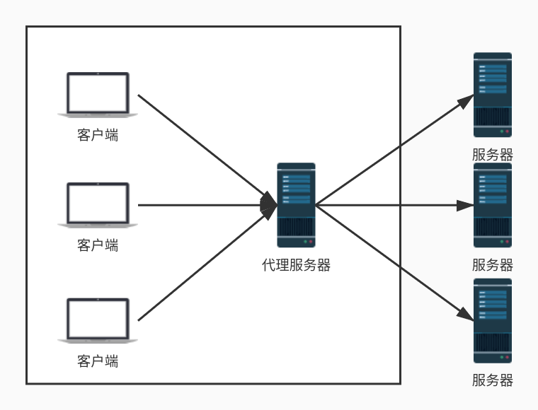
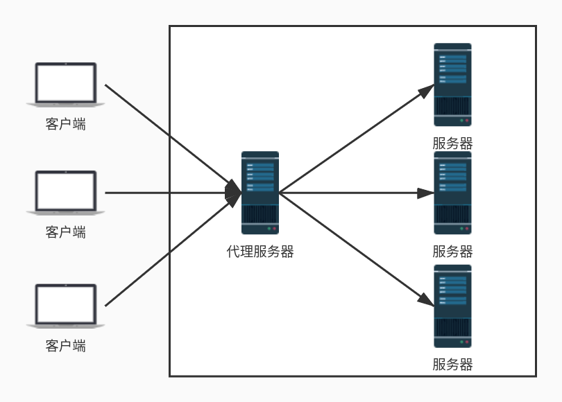
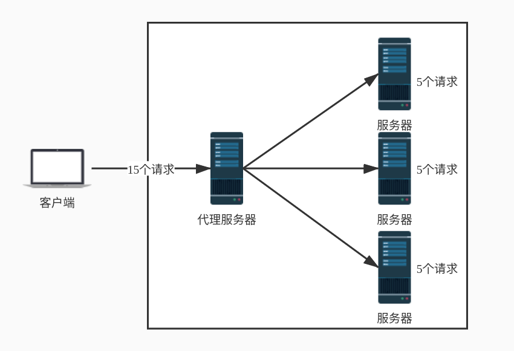
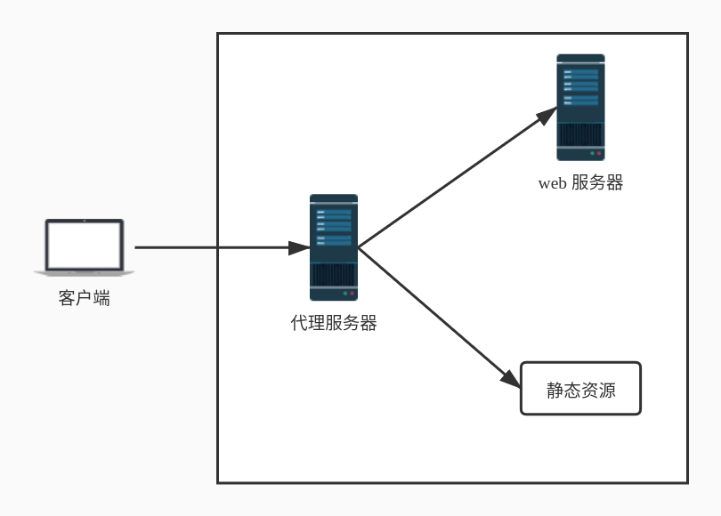

# Nginx 简介

- [Nginx 简介](#nginx-简介)
  - [Nginx 是什么？](#nginx-是什么)
  - [Nginx 主要功能](#nginx-主要功能)
    - [正向代理](#正向代理)
    - [反向代理](#反向代理)
    - [负载均衡](#负载均衡)
    - [动静分离](#动静分离)
  - [Nginx 安装](#nginx-安装)
    - [Nginx 依赖包](#nginx-依赖包)
    - [安装依赖包](#安装依赖包)
    - [安装 Nginx](#安装-nginx)
  - [Nginx 常用命令](#nginx-常用命令)

## Nginx 是什么？

Nginx (engine x) 是一个高性能的 HTTP 和反向代理 web 服务器，同时也提供了 IMAP/POP3/SMTP 服务。其特点是占有内存少，并发能力强。官方测试数据表明能支持高达 50000 个并发连接数的响应。

> **Tips:** 所谓代理服务器就是位于发起请求的客户端与原始服务器端之间的一台跳板服务器，正向代理可以隐藏客户端，反向代理可以隐藏原始服务器。

## Nginx 主要功能

### 正向代理

用户知道目标服务器地址，但由于网络限制等原因，无法直接访问。这时候需要先连接代理服务器，然后再由代理服务器访问目标服务器。



### 反向代理

用户不知道目标服务器地址。比如访问百度网站，百度的代理服务器对外的域名为 [www.baidu.com](www.baidu.com)，具体内部的服务器节点并不知道。通过访问百度的代理服务器，代理服务器将请求转发到内部的服务器节点，响应后将结果返回。



### 负载均衡

将负载（请求）进行平衡、视情况分摊到多个服务器上进行处理。



### 动静分离

将网站静态资源（例如：HTML，JavaScript，CSS，img 等文件）与后台应用分开部署，提高用户访问静态代码的速度，降低对后台应用访问。



## Nginx 安装

### Nginx 依赖包

- ssl 功能需要 [openssl](https://www.openssl.org) 库
- gzip 模块需要 [zlib](http://www.pcre.org) 库
- rewrite 模块需要 [pcre](http://www.pcre.org) 库

### 安装依赖包

```bash
# 提前下载号依赖包的源码压缩包
# 安装 openssl
tar -zxvf openssl-fips-2.0.2.tar.gz
cd openssl-fips-2.0.2
./config
make && make install

# 安装 zlib
tar -zxvf zlib-1.2.7.tar.gz
cd zlib-1.2.7
./configure
make && make install

# 安装 pcre
tar -zxvf pcre-8.21.tar.gz
cd pcre-8.21
./configure
make && make install
```

### 安装 Nginx

```bash
tar -zxvf nginx-1.12.2.tar.gz
cd nginx-1.12.2
# 默认安装路径为 /usr/local/nginx，可使用 --prefix 选项指定路径安装
./configure
make && make install
```

## Nginx 常用命令

```bash
cd /usr/local/nginx
# 启动
./nginx
# 强制停止，无论当前有没有正在处理的请求
./nginx -s stop
# 停止，在退出前完成已经接受的连接请求
./nginx -s quit
# 修改配置后重新加载生效
./nginx -s reload
# 重新打开日志文件
./nginx -s reopen
```
