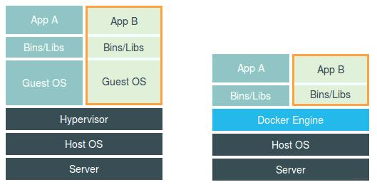

# Docker 简介

- [Docker 简介](#docker-简介)
  - [Docker 基本组成](#docker-基本组成)
    - [客户端（client）](#客户端client)
    - [服务器（server）](#服务器server)
    - [镜像（image）](#镜像image)
    - [容器（container）](#容器container)
    - [仓库（repository）](#仓库repository)
  - [Docker 版本](#docker-版本)
    - [docker.io](#dockerio)
    - [docker-engine](#docker-engine)
      - [docker-ce](#docker-ce)
      - [docker-ee](#docker-ee)
  - [Docker 和虚拟机的区别](#docker-和虚拟机的区别)
  - [Docker 相关网站](#docker-相关网站)

## Docker 基本组成

Docker 是 客户端-服务器（C/S） 架构的程序。

### 客户端（client）

Client 端为命令行工具 docker 或由 docker RESTful API 开发的自定义容器。

### 服务器（server）

Server 端为 dockerd （docker daemon）。

daemon （守护进程）是生存期长且不受终端控制的进程。

### 镜像（image）

镜像是一系列文件和指令的集合，是 Docker 生命周期中 “构建” 的部分。

### 容器（container）

容器是一个执行环境，镜像在容器中创建和启动，是 Docker 生命周期中启动或执行阶段。

### 仓库（repository）

用来保存用户构建的镜像，分公有仓库和私有仓库。

## Docker 版本

### docker.io

由 Debian 提供，由于截止 2019.8 有大约一年没有维护，所以被误认为过时，现又恢复维护。

使用 apt 方式管理依赖。

### docker-engine

由 docker.com 提供

Docker 的早期版本（0.1.0~1.13.1），后分为社区版和企业版。

使用 go 的方式自己管理依赖。

#### docker-ce

全称 docker Community Edition，是社区版本。

用时间来定义版本，早期的 17.03.0 等同于 docker-engine 的 1.13.1 版本

#### docker-ee

全称 docker Engine Edition，是企业版本。

## Docker 和虚拟机的区别

||Docker|VM|
|:-:|:-:|:-:|
|虚拟化类型|OS虚拟化|硬件虚拟化|
|系统内核|直接使用宿主机内核|重新加载客户机操作系统|
|性能|=物理机性能|操作系统会有额外的CPU和内存消耗|
|隔离性|Namespace 隔离|强|
|安全性|中|强|
|GuestOS|只支持Linux|全部|

## Docker 相关网站

- [Docker 官网](https://www.docker.com/)
- [Docker Hub](https://hub.docker.com/)
- [Docker 文档](https://docs.docker.com/)
- [Docker 常用命令查询](https://docs.docker.com/reference/)