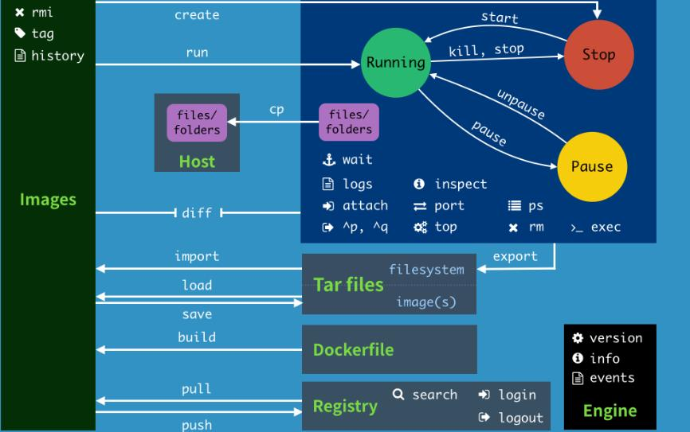

# Docker 命令

- [Docker 命令](#docker-命令)
  - [帮助命令](#帮助命令)
  - [常用镜像命令](#常用镜像命令)
    - [docker images](#docker-images)
    - [docker search](#docker-search)
    - [docker pull](#docker-pull)
    - [docker rmi](#docker-rmi)
  - [常用容器命令](#常用容器命令)
    - [docker run](#docker-run)
    - [docker ps](#docker-ps)
    - [docker rm](#docker-rm)
    - [docker start](#docker-start)
    - [docker restart](#docker-restart)
    - [docker stop](#docker-stop)
    - [docker kill](#docker-kill)
    - [docker exec](#docker-exec)
    - [docker attach](#docker-attach)
    - [docker cp](#docker-cp)
    - [docer logs](#docer-logs)
    - [docker top](#docker-top)
    - [docker inspect](#docker-inspect)
    - [docker commit](#docker-commit)



## 帮助命令

```bash
docker version # 查询 Docker 版本信息
docker info # 查询 Docker 系统信息，包括镜像和容器的数量等
docker <command> --help # 查询指定命令的使用手册
```

具体使用方法可查询 [Docker CLI 官方文档](https://docs.docker.com/engine/reference/commandline/docker/)

## 常用镜像命令

### [docker images](https://docs.docker.com/engine/reference/commandline/images/)

列出所有本地镜像的信息

```shell
endruz@Ubuntu:~$ docker images
REPOSITORY                              TAG       IMAGE ID       CREATED         SIZE
hello-world                             latest    d1165f221234   2 weeks ago     13.3kB
```

|列名|含义|
|:--|:--|
|REPOSITORY|镜像仓库源|
|TAG|镜像标签|
|DIGEST|镜像 digest|
|IMAGE ID|镜像 ID|
|CREATED|镜像已创建的时间|
|SIZE|镜像大小|

```shell
endruz@Ubuntu:~$ docker images --help

Usage:  docker images [OPTIONS] [REPOSITORY[:TAG]]

List images

Options:
  -a, --all             Show all images (default hides intermediate images)
      --digests         Show digests
  -f, --filter filter   Filter output based on conditions provided
      --format string   Pretty-print images using a Go template
      --no-trunc        Don't truncate output
  -q, --quiet           Only show image IDs
```

### [docker search](https://docs.docker.com/engine/reference/commandline/search/)

在 Docker Hub 中搜索镜像

```shell
endruz@Ubuntu:~$ docker search python --filter STARS=1000
NAME      DESCRIPTION                                     STARS     OFFICIAL   AUTOMATED
python    Python is an interpreted, interactive, objec…   5967      [OK]
django    Django is a free web application framework, …   1053      [OK]
```

|列名|含义|
|:--|:--|
|NAME|镜像名|
|DESCRIPTION|镜像描述|
|STARS|镜像的 stars 数|
|OFFICIAL|官方镜像|
|AUTOMATED|自动构建|

```shell
endruz@Ubuntu:~$ docker search --help

Usage:  docker search [OPTIONS] TERM

Search the Docker Hub for images

Options:
  -f, --filter filter   Filter output based on conditions provided
      --format string   Pretty-print search using a Go template
      --limit int       Max number of search results (default 25)
      --no-trunc        Don't truncate output

```

### [docker pull](https://docs.docker.com/engine/reference/commandline/pull/)

从 registry 中拉取镜像或仓库

```shell
endruz@Ubuntu:~$ docker pull --help

Usage:  docker pull [OPTIONS] NAME[:TAG|@DIGEST]

Pull an image or a repository from a registry

Options:
  -a, --all-tags                Download all tagged images in the repository
      --disable-content-trust   Skip image verification (default true)
      --platform string         Set platform if server is multi-platform capable
  -q, --quiet                   Suppress verbose output
```

### [docker rmi](https://docs.docker.com/engine/reference/commandline/rmi/)

删除一个或多个镜像

```shell
endruz@Ubuntu:~$ docker rmi --help

Usage:  docker rmi [OPTIONS] IMAGE [IMAGE...]

Remove one or more images

Options:
  -f, --force      Force removal of the image
      --no-prune   Do not delete untagged parents
```

常用命令

```bash
# 删除所有镜像
docker rmi $(docker images -aq)
# 删除所有未标记的镜像
docker rmi $(docker images -f "dangling=true" -q)
```

## 常用容器命令

### [docker run](https://docs.docker.com/engine/reference/commandline/run/)

常用参数

|参数名|描述|
|:--|:--|
|--name|为容器分配一个名称|
|-d|在后台运行容器并打印容器 ID|
|-i|即使未连接 STDIN，也应使其保持打开状态|
|-t|分配伪 TTY|
|-p|将容器的端口映射到到主机， -p 主机端口:容器端口|

一般 `-i` 和 `-t` 连用，后加启动命令 `/bin/bash` 来直接运行容器并以交互的方式执行 bash，如：

```bash
docker run -it [IMAGE] /bin/bash
```

退出容器方法:

- `exit` 退出并停止容器
- `ctrl+d` 退出并停止容器
- `ctrl+p+q` 退出容器

### [docker ps](https://docs.docker.com/engine/reference/commandline/ps/)

列出容器

```shell
endruz@Ubuntu:~$ docker ps --help

Usage:  docker ps [OPTIONS]

List containers

Options:
  -a, --all             Show all containers (default shows just running)
  -f, --filter filter   Filter output based on conditions provided
      --format string   Pretty-print containers using a Go template
  -n, --last int        Show n last created containers (includes all states) (default -1)
  -l, --latest          Show the latest created container (includes all states)
      --no-trunc        Don't truncate output
  -q, --quiet           Only display container IDs
  -s, --size            Display total file sizes
```

### [docker rm](https://docs.docker.com/engine/reference/commandline/rm/)

```shell
endruz@Ubuntu:~$ docker rm --help

Usage:  docker rm [OPTIONS] CONTAINER [CONTAINER...]

Remove one or more containers

Options:
  -f, --force     Force the removal of a running container (uses SIGKILL)
  -l, --link      Remove the specified link
  -v, --volumes   Remove anonymous volumes associated with the container
```

常用命令

```bash
# 删除所有镜像
docker rm -f $(docker ps -aq)
# 删除所有已停止容器
docker rm $(docker ps --filter status=exited -q)
```

### [docker start](https://docs.docker.com/engine/reference/commandline/start/)

启动一个或多个已停止容器

```shell
endruz@Ubuntu:~$ docker start --help

Usage:  docker start [OPTIONS] CONTAINER [CONTAINER...]

Start one or more stopped containers

Options:
  -a, --attach               Attach STDOUT/STDERR and forward signals
      --detach-keys string   Override the key sequence for detaching a container
  -i, --interactive          Attach container's STDIN
```

### [docker restart](https://docs.docker.com/engine/reference/commandline/restart/)

重启一个或多个容器

```shell
endruz@Ubuntu:~$ docker restart --help

Usage:  docker restart [OPTIONS] CONTAINER [CONTAINER...]

Restart one or more containers

Options:
  -t, --time int   Seconds to wait for stop before killing the container (default 10)
```

### [docker stop](https://docs.docker.com/engine/reference/commandline/stop/)

停止一个或多个正在运行容器

```shell
endruz@Ubuntu:~$ docker stop --help

Usage:  docker stop [OPTIONS] CONTAINER [CONTAINER...]

Stop one or more running containers

Options:
  -t, --time int   Seconds to wait for stop before killing it (default 10)
```

### [docker kill](https://docs.docker.com/engine/reference/commandline/kill/)

杀死一个或多个正在运行的容器

```shell
endruz@Ubuntu:~$ docker kill --help

Usage:  docker kill [OPTIONS] CONTAINER [CONTAINER...]

Kill one or more running containers

Options:
  -s, --signal string   Signal to send to the container (default "KILL")
```

### [docker exec](https://docs.docker.com/engine/reference/commandline/exec/)

在正在运行的容器中运行命令

```shell
endruz@Ubuntu:~$ docker exec --help

Usage:  docker exec [OPTIONS] CONTAINER COMMAND [ARG...]

Run a command in a running container

Options:
  -d, --detach               Detached mode: run command in the background
      --detach-keys string   Override the key sequence for detaching a container
  -e, --env list             Set environment variables
      --env-file list        Read in a file of environment variables
  -i, --interactive          Keep STDIN open even if not attached
      --privileged           Give extended privileges to the command
  -t, --tty                  Allocate a pseudo-TTY
  -u, --user string          Username or UID (format: <name|uid>[:<group|gid>])
  -w, --workdir string       Working directory inside the container
```

类似于 `docker run` 使用 `-it` 后加启动命令 `/bin/bash` 来直接容器中的 bash，如：

```bash
docker exec -it [CONTAINER] /bin/bash
```

### [docker attach](https://docs.docker.com/engine/reference/commandline/attach/)

将本地标准输入，输出和错误流附加到正在运行的容器

```shell
endruz@Ubuntu:~$ docker attach --help

Usage:  docker attach [OPTIONS] CONTAINER

Attach local standard input, output, and error streams to a running container

Options:
      --detach-keys string   Override the key sequence for detaching a container
      --no-stdin             Do not attach STDIN
      --sig-proxy            Proxy all received signals to the process (default true)
```

使用 `docker attach` 可以直接打开启动命令是 `/bin/bash` 的容器的 bash。

与 `docker exec` 不同的是 `docker attach` 不会另起进程。

### [docker cp](https://docs.docker.com/engine/reference/commandline/cp/)

在容器和本地文件系统之间复制文件/文件夹

```shell
endruz@Ubuntu:~$ docker cp --help

Usage:  docker cp [OPTIONS] CONTAINER:SRC_PATH DEST_PATH|-
  docker cp [OPTIONS] SRC_PATH|- CONTAINER:DEST_PATH

Copy files/folders between a container and the local filesystem

Use '-' as the source to read a tar archive from stdin
and extract it to a directory destination in a container.
Use '-' as the destination to stream a tar archive of a
container source to stdout.

Options:
  -a, --archive       Archive mode (copy all uid/gid information)
  -L, --follow-link   Always follow symbol link in SRC_PATH
```

### [docer logs](https://docs.docker.com/engine/reference/commandline/logs/)

获取容器的日志

```shell
endruz@Ubuntu:~$ docker logs --help

Usage:  docker logs [OPTIONS] CONTAINER

Fetch the logs of a container

Options:
      --details        Show extra details provided to logs
  -f, --follow         Follow log output
      --since string   Show logs since timestamp (e.g. 2013-01-02T13:23:37Z) or relative (e.g. 42m for 42 minutes)
  -n, --tail string    Number of lines to show from the end of the logs (default "all")
  -t, --timestamps     Show timestamps
      --until string   Show logs before a timestamp (e.g. 2013-01-02T13:23:37Z) or relative (e.g. 42m for 42 minutes)
```

### [docker top](https://docs.docker.com/engine/reference/commandline/top/)

显示容器的进程

```shell
endruz@Ubuntu:~$ docker top --help

Usage:  docker top CONTAINER [ps OPTIONS]

Display the running processes of a container
```

### [docker inspect](https://docs.docker.com/engine/reference/commandline/inspect/)

返回有关 Docker 对象的元数据

```shell
endruz@Ubuntu:~$ docker inspect --help

Usage:  docker inspect [OPTIONS] NAME|ID [NAME|ID...]

Return low-level information on Docker objects

Options:
  -f, --format string   Format the output using the given Go template
  -s, --size            Display total file sizes if the type is container
      --type string     Return JSON for specified type
```

### [docker commit](https://docs.docker.com/engine/reference/commandline/commit/)

根据容器的更改创建新图像

```shell
endruz@Ubuntu:~$ docker commit --help

Usage:  docker commit [OPTIONS] CONTAINER [REPOSITORY[:TAG]]

Create a new image from a container's changes

Options:
  -a, --author string    Author (e.g., "John Hannibal Smith <hannibal@a-team.com>")
  -c, --change list      Apply Dockerfile instruction to the created image
  -m, --message string   Commit message
  -p, --pause            Pause container during commit (default true)
```
