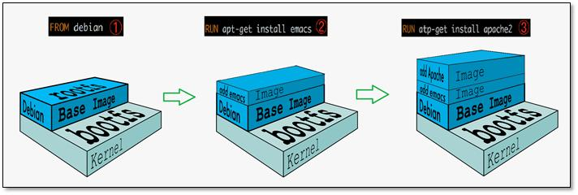

# Docker 镜像

- [Docker 镜像](#docker-镜像)
  - [构建镜像的方式](#构建镜像的方式)
  - [镜像加载原理](#镜像加载原理)
    - [UnionFS（联合文件系统）](#unionfs联合文件系统)
    - [Docker 镜像加载原理](#docker-镜像加载原理)

## 构建镜像的方式

1. docker commit 命令
2. 使用 Dockerfile 构建

## 镜像加载原理

### UnionFS（联合文件系统）

是一种分层、轻量级并且高性能的文件系统。它支持对文件系统的修改作为一次提交来一层层的叠加，同时可以将不同目录挂载到同一虚拟文件系统下。

UnionFS 是 Docker 镜像的基础。镜像可以通过分层来进行继承，基于基础镜像（没有父镜像），可以制作各种具体的应用镜像。

特性：一次同时加载多个文件系统，但从外面看起来，只能看到一个文件系统，联合加载会把各层文件系统叠加起来，这样最终文件系统会包含所有底层的文件和目录。

### Docker 镜像加载原理

Docker 镜像实际上是由一层一层的文件系统组成的，这种文件系统是 UnionFS。

镜像最底层是 bootfs (boot file system)，包含 bootloader 和 kernel。bootloader 的作用是引导加载 kernel，当 kernel 都被加载到内存之后，系统会卸载 bootfs。

镜像第二层是 rootfs (root file system)，包含的是典型的 Linux 系统中的 /dev, /proc, /bin, /etc 等标准目录和文件。

不同的 Linux 发行版本，bootfs 基本相同，而 rootfs 不同，如 Ubuntu，CentOS 等。

Docker 镜像分层构建的好处是：已经下载过的镜像文件可以被后面需要的镜像复用。

Docker 镜像都是只读的文件系统，当容器启动时，会在顶层加一个可读写文件系统。这一层叫做容器层，容器之下都叫镜像层。
