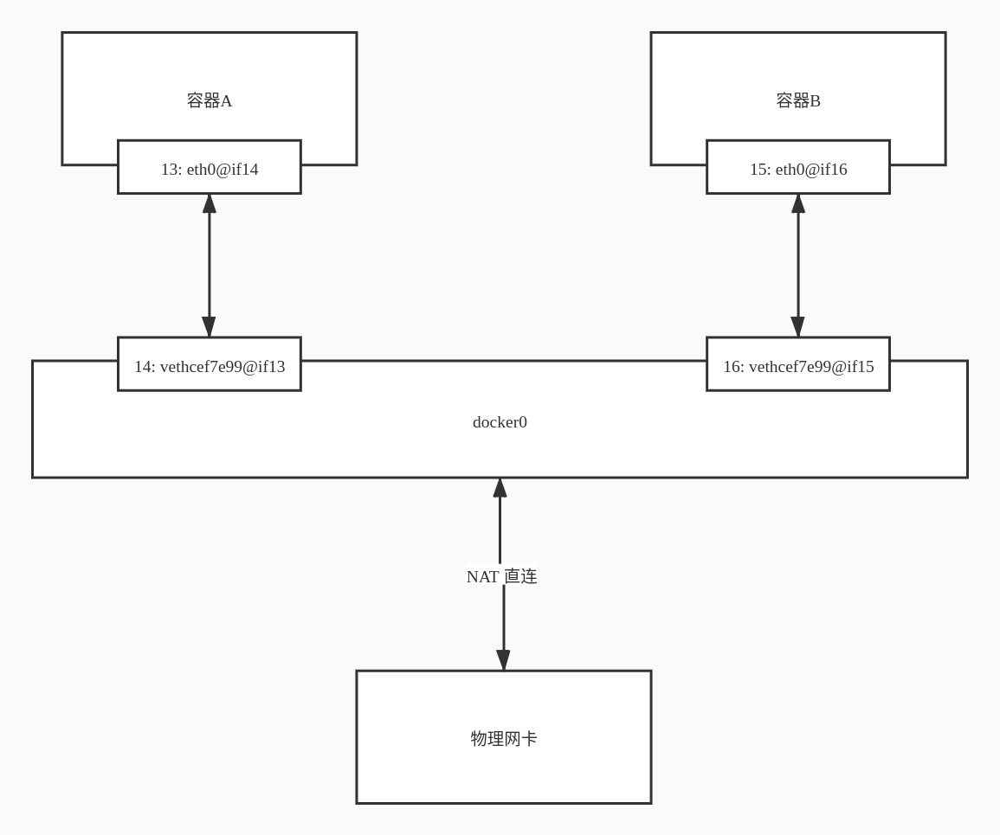

# Docker 网络

- [Docker 网络](#docker-网络)
  - [理解 docker0](#理解-docker0)
  - [容器互联](#容器互联)
    - [docker run --link](#docker-run---link)
    - [自定义网络](#自定义网络)
  - [网络连通](#网络连通)

## 理解 docker0

```shell
# lo：本机回环地址
# ens33：网卡地址
# docker0：docker0 地址
# 只要安装了 Docker，就会有一个网卡 docker0，属于桥接模式，使用的技术是 evth-pair。
$ ip a
1: lo: <LOOPBACK,UP,LOWER_UP> mtu 65536 qdisc noqueue state UNKNOWN group default qlen 1000
    link/loopback 00:00:00:00:00:00 brd 00:00:00:00:00:00
    inet 127.0.0.1/8 scope host lo
       valid_lft forever preferred_lft forever
    inet6 ::1/128 scope host
       valid_lft forever preferred_lft forever
2: ens33: <BROADCAST,MULTICAST,UP,LOWER_UP> mtu 1500 qdisc fq_codel state UP group default qlen 1000
    link/ether 00:0c:29:1e:5c:14 brd ff:ff:ff:ff:ff:ff
    altname enp2s1
    inet 192.168.116.129/24 brd 192.168.116.255 scope global dynamic noprefixroute ens33
       valid_lft 1477sec preferred_lft 1477sec
    inet6 fe80::e0ab:b7ea:d5e8:3201/64 scope link noprefixroute
       valid_lft forever preferred_lft forever
3: docker0: <NO-CARRIER,BROADCAST,MULTICAST,UP> mtu 1500 qdisc noqueue state DOWN group default
    link/ether 02:42:b3:98:a6:cd brd ff:ff:ff:ff:ff:ff
    inet 172.17.0.1/16 brd 172.17.255.255 scope global docker0
       valid_lft forever preferred_lft forever
```

```shell
$ docker run -d -i --name ubuntu01 ubuntu
11ef7b9cd2dad3f0127832532610adfb44e51025a7469cffbb5191779712cc7f
$ docker ps
CONTAINER ID   IMAGE     COMMAND       CREATED         STATUS         PORTS     NAMES
11ef7b9cd2da   ubuntu    "/bin/bash"   9 seconds ago   Up 8 seconds             ubuntu01
# 安装 ip 和 ping 命令
$ docker exec -it ubuntu01 apt update
$ docker exec -it ubuntu01 apt install -y iproute2 inetutils-ping
$ docker exec -it ubuntu01 apt clean -y
# 每启动一个 Docker 容器， Docker 都会给容器分配一个 ip。
$ docker exec -it ubuntu01 ip a
1: lo: <LOOPBACK,UP,LOWER_UP> mtu 65536 qdisc noqueue state UNKNOWN group default qlen 1000
    link/loopback 00:00:00:00:00:00 brd 00:00:00:00:00:00
    inet 127.0.0.1/8 scope host lo
       valid_lft forever preferred_lft forever
13: eth0@if14: <BROADCAST,MULTICAST,UP,LOWER_UP> mtu 1500 qdisc noqueue state UP group default
    link/ether 02:42:ac:11:00:02 brd ff:ff:ff:ff:ff:ff link-netnsid 0
    inet 172.17.0.2/16 brd 172.17.255.255 scope global eth0
       valid_lft forever preferred_lft forever
# 宿主机和容器，容器和容器之间是可以 ping 通的
$ ping 172.17.0.2
PING 172.17.0.2 (172.17.0.2) 56(84) bytes of data.
64 bytes from 172.17.0.2: icmp_seq=1 ttl=64 time=0.111 ms
64 bytes from 172.17.0.2: icmp_seq=2 ttl=64 time=0.128 ms
--- 172.17.0.2 ping statistics ---
2 packets transmitted, 2 received, 0% packet loss, time 1022ms
rtt min/avg/max/mdev = 0.111/0.119/0.128/0.008 ms
# 容器内网卡 eth0@if14 和 启动容器后本地新增的网卡 vethcef7e99@if13 对应
$ ip a
1: lo: <LOOPBACK,UP,LOWER_UP> mtu 65536 qdisc noqueue state UNKNOWN group default qlen 1000
    link/loopback 00:00:00:00:00:00 brd 00:00:00:00:00:00
    inet 127.0.0.1/8 scope host lo
       valid_lft forever preferred_lft forever
    inet6 ::1/128 scope host
       valid_lft forever preferred_lft forever
2: ens33: <BROADCAST,MULTICAST,UP,LOWER_UP> mtu 1500 qdisc fq_codel state UP group default qlen 1000
    link/ether 00:0c:29:1e:5c:14 brd ff:ff:ff:ff:ff:ff
    altname enp2s1
    inet 192.168.116.129/24 brd 192.168.116.255 scope global dynamic noprefixroute ens33
       valid_lft 1300sec preferred_lft 1300sec
    inet6 fe80::e0ab:b7ea:d5e8:3201/64 scope link noprefixroute
       valid_lft forever preferred_lft forever
3: docker0: <BROADCAST,MULTICAST,UP,LOWER_UP> mtu 1500 qdisc noqueue state UP group default
    link/ether 02:42:b3:98:a6:cd brd ff:ff:ff:ff:ff:ff
    inet 172.17.0.1/16 brd 172.17.255.255 scope global docker0
       valid_lft forever preferred_lft forever
    inet6 fe80::42:b3ff:fe98:a6cd/64 scope link
       valid_lft forever preferred_lft forever
14: vethcef7e99@if13: <BROADCAST,MULTICAST,UP,LOWER_UP> mtu 1500 qdisc noqueue master docker0 state UP group default
    link/ether 5a:0b:01:24:cb:ea brd ff:ff:ff:ff:ff:ff link-netnsid 0
    inet6 fe80::580b:1ff:fe24:cbea/64 scope link
       valid_lft forever preferred_lft forever
```

evth-pair 是一对的虚拟设备接口，都是成对出现的，一段连着协议，一段彼此相连。

正因为有这个特性，evth-pair 充当一个桥梁，连接各种虚拟网络设备。

Docker 使用的时 Linux 的桥接，docker0 是宿主机中 Docker 容器的一个网桥。



Docker 中所有的网络接口都是虚拟的，虚拟的转发效率高。

```shell
# docker network 命令帮助
$ docker network --help

Usage:  docker network COMMAND

Manage networks

Commands:
  connect     Connect a container to a network
  create      Create a network
  disconnect  Disconnect a container from a network
  inspect     Display detailed information on one or more networks
  ls          List networks
  prune       Remove all unused networks
  rm          Remove one or more networks

Run 'docker network COMMAND --help' for more information on a command.
# bridge 为 docker0
$ docker network ls
NETWORK ID     NAME      DRIVER    SCOPE
c5a591d1e17e   bridge    bridge    local
b6f318a06b58   host      host      local
f33f0eaa71aa   none      null      local
$ docker network inspect c5a591d1e17e
[
    {
        "Name": "bridge",
        "Id": "c5a591d1e17e85dbcbdee5a0dbc41d2430b4fa735662a30c3ca717935cb58655",
        "Created": "2021-03-27T14:22:06.968332251+08:00",
        "Scope": "local",
        "Driver": "bridge",
        "EnableIPv6": false,
        "IPAM": {
            "Driver": "default",
            "Options": null,
            "Config": [
                {
                    "Subnet": "172.17.0.0/16",
                    "Gateway": "172.17.0.1"
                }
            ]
        },
        "Internal": false,
        "Attachable": false,
        "Ingress": false,
        "ConfigFrom": {
            "Network": ""
        },
        "ConfigOnly": false,
        "Containers": {
            "11ef7b9cd2dad3f0127832532610adfb44e51025a7469cffbb5191779712cc7f": {
                "Name": "ubuntu01",
                "EndpointID": "a952d6cb4229d060aa8d23d4c4fcf3f7a73bffdb7ac4ac1b19d51c54f253598c",
                "MacAddress": "02:42:ac:11:00:02",
                "IPv4Address": "172.17.0.2/16",
                "IPv6Address": ""
            },
            "13a245b9ca52cd7a312a5a72fc0f0d195d9afcb2e96ac0af1e6f907723e5ce1b": {
                "Name": "ubuntu02",
                "EndpointID": "1cc0c7ef8108fe9b685e4fe77670861601d1c6c11519e9e0ec5dd58fdd4df93d",
                "MacAddress": "02:42:ac:11:00:03",
                "IPv4Address": "172.17.0.3/16",
                "IPv6Address": ""
            },
            "d44052b3f7b2326a57d18f0b7f477901cc57c99ca508cd5bb15d7a7c1bee51b5": {
                "Name": "ubuntu03",
                "EndpointID": "9af5afbda2898cf5fc062f37007a05ea089eb4c7a2a03764d5ee6cfbd4b02312",
                "MacAddress": "02:42:ac:11:00:04",
                "IPv4Address": "172.17.0.4/16",
                "IPv6Address": ""
            }
        },
        "Options": {
            "com.docker.network.bridge.default_bridge": "true",
            "com.docker.network.bridge.enable_icc": "true",
            "com.docker.network.bridge.enable_ip_masquerade": "true",
            "com.docker.network.bridge.host_binding_ipv4": "0.0.0.0",
            "com.docker.network.bridge.name": "docker0",
            "com.docker.network.driver.mtu": "1500"
        },
        "Labels": {}
    }
]
$ ip a
1: lo: <LOOPBACK,UP,LOWER_UP> mtu 65536 qdisc noqueue state UNKNOWN group default qlen 1000
    link/loopback 00:00:00:00:00:00 brd 00:00:00:00:00:00
    inet 127.0.0.1/8 scope host lo
       valid_lft forever preferred_lft forever
    inet6 ::1/128 scope host
       valid_lft forever preferred_lft forever
2: ens33: <BROADCAST,MULTICAST,UP,LOWER_UP> mtu 1500 qdisc fq_codel state UP group default qlen 1000
    link/ether 00:0c:29:1e:5c:14 brd ff:ff:ff:ff:ff:ff
    altname enp2s1
    inet 192.168.116.129/24 brd 192.168.116.255 scope global dynamic noprefixroute ens33
       valid_lft 1702sec preferred_lft 1702sec
    inet6 fe80::e0ab:b7ea:d5e8:3201/64 scope link noprefixroute
       valid_lft forever preferred_lft forever
3: docker0: <BROADCAST,MULTICAST,UP,LOWER_UP> mtu 1500 qdisc noqueue state UP group default
    link/ether 02:42:b3:98:a6:cd brd ff:ff:ff:ff:ff:ff
    inet 172.17.0.1/16 brd 172.17.255.255 scope global docker0
       valid_lft forever preferred_lft forever
    inet6 fe80::42:b3ff:fe98:a6cd/64 scope link
       valid_lft forever preferred_lft forever
14: vethcef7e99@if13: <BROADCAST,MULTICAST,UP,LOWER_UP> mtu 1500 qdisc noqueue master docker0 state UP group default
    link/ether 5a:0b:01:24:cb:ea brd ff:ff:ff:ff:ff:ff link-netnsid 0
    inet6 fe80::580b:1ff:fe24:cbea/64 scope link
       valid_lft forever preferred_lft forever
16: veth30fbf7b@if15: <BROADCAST,MULTICAST,UP,LOWER_UP> mtu 1500 qdisc noqueue master docker0 state UP group default
    link/ether d2:a0:38:38:93:0f brd ff:ff:ff:ff:ff:ff link-netnsid 1
    inet6 fe80::d0a0:38ff:fe38:930f/64 scope link
       valid_lft forever preferred_lft forever
18: veth69b99d4@if17: <BROADCAST,MULTICAST,UP,LOWER_UP> mtu 1500 qdisc noqueue master docker0 state UP group default
    link/ether 12:2d:d4:f8:61:ac brd ff:ff:ff:ff:ff:ff link-netnsid 2
    inet6 fe80::102d:d4ff:fef8:61ac/64 scope link
       valid_lft forever preferred_lft forever
```

特点：

1. 默认是 bridge
2. 域名不能访问
3. 可以使用 `docker run --link` 实现容器互联

## 容器互联

### docker run --link

```shell
$ docker run -d -i --name ubuntu02 ubuntu
13a245b9ca52cd7a312a5a72fc0f0d195d9afcb2e96ac0af1e6f907723e5ce1b
# 安装 ip 和 ping 命令
$ docker exec -it ubuntu02 apt update
$ docker exec -it ubuntu02 apt install -y iproute2 inetutils-ping
$ docker exec -it ubuntu02 apt clean -y
# 容器内无法直接通过容器名 ping
$ docker exec -it ubuntu02 ping ubuntu01
ping: unknown host

# 启动容器时添加 --link 参数，
$ docker run -d -i --name ubuntu03 --link ubuntu01 ubuntu
d44052b3f7b2326a57d18f0b7f477901cc57c99ca508cd5bb15d7a7c1bee51b5
# 相当于在 /etc/hosts 中加了一行解析
$ docker exec -it ubuntu03 cat /etc/hosts
127.0.0.1   localhost
::1 localhost ip6-localhost ip6-loopback
fe00::0 ip6-localnet
ff00::0 ip6-mcastprefix
ff02::1 ip6-allnodes
ff02::2 ip6-allrouters
172.17.0.2  ubuntu01 11ef7b9cd2da
172.17.0.4  d44052b3f7b2
# 安装 ip 和 ping 命令
$ docker exec -it ubuntu03 apt update
$ docker exec -it ubuntu03 apt install -y iproute2 inetutils-ping
$ docker exec -it ubuntu03 apt clean -y
# 可以直接通过容器名 ping 通
$ docker exec -it ubuntu03 ping ubuntu01
PING ubuntu01 (172.17.0.2): 56 data bytes
64 bytes from 172.17.0.2: icmp_seq=0 ttl=64 time=0.165 ms
64 bytes from 172.17.0.2: icmp_seq=1 ttl=64 time=0.206 ms
64 bytes from 172.17.0.2: icmp_seq=2 ttl=64 time=0.202 ms
--- ubuntu01 ping statistics ---
3 packets transmitted, 3 packets received, 0% packet loss
round-trip min/avg/max/stddev = 0.165/0.191/0.206/0.000 ms
# 反向不可以 ping 通
$ docker exec -it ubuntu01 ping ubuntu03
ping: unknown host
```

### 自定义网络

网络模式：

1. bridge：桥接模式（默认使用）
2. null：不配置网络
3. host：和宿主机共享网络
4. container：容器网络连通

```shell
$ docker network ls
NETWORK ID     NAME      DRIVER    SCOPE
c5a591d1e17e   bridge    bridge    local
b6f318a06b58   host      host      local
f33f0eaa71aa   none      null      local
```

```shell
# docker network create 命令帮助
$ docker network create --help

Usage:  docker network create [OPTIONS] NETWORK

Create a network

Options:
      --attachable           Enable manual container attachment
      --aux-address map      Auxiliary IPv4 or IPv6 addresses used by Network driver (default map[])
      --config-from string   The network from which to copy the configuration
      --config-only          Create a configuration only network
  -d, --driver string        Driver to manage the Network (default "bridge")
      --gateway strings      IPv4 or IPv6 Gateway for the master subnet
      --ingress              Create swarm routing-mesh network
      --internal             Restrict external access to the network
      --ip-range strings     Allocate container ip from a sub-range
      --ipam-driver string   IP Address Management Driver (default "default")
      --ipam-opt map         Set IPAM driver specific options (default map[])
      --ipv6                 Enable IPv6 networking
      --label list           Set metadata on a network
  -o, --opt map              Set driver specific options (default map[])
      --scope string         Control the network\'s scope
      --subnet strings       Subnet in CIDR format that represents a network segment
# 自定义网络
# -d bridge 模式，默认为桥接模式
# --subnet 192.168.0.0/16 子网
# 可用 ip 为 192.168.0.2 ~ 192.168.255.255 为 255*255-1 个
# 若为 192.168.0.0/24 则为 192.168.0.2 ~ 192.168.0.255，255-1 个
# --gateway 192.168.0.1 网关
$ docker network create -d bridge --subnet 192.168.0.0/16 --gateway 192.168.0.1 mynet
851c834f49c951df19c7b01a9f9bc97603067a6c0127be02cb3252d88a070658
# 查看现有的 Docker 网络
$ docker network ls
NETWORK ID     NAME      DRIVER    SCOPE
c5a591d1e17e   bridge    bridge    local
b6f318a06b58   host      host      local
851c834f49c9   mynet     bridge    local
f33f0eaa71aa   none      null      local
# 在自定义网络上启动容器
$ docker run -d -i --name ubuntu04 --net mynet ubuntu
cb92c0173e7192eac8086207688177e57daa14e132bc97b5b91e5e8816bd1b9a
$ docker run -d -i --name ubuntu05 --net mynet ubuntu
1d478fcac4a67d1e478dff8eab108f30daea282a953aec7dc8721b06bfe8bc84
# 安装 ip 和 ping 命令
$ docker exec -it ubuntu04 apt update
$ docker exec -it ubuntu04 apt install -y iproute2 inetutils-ping
$ docker exec -it ubuntu04 apt clean -y
$ docker exec -it ubuntu05 apt update
$ docker exec -it ubuntu05 apt install -y iproute2 inetutils-ping
$ docker exec -it ubuntu05 apt clean -y
# 查看自定义网络 mynet 详情
$ docker network inspect mynet
[
    {
        "Name": "mynet",
        "Id": "851c834f49c951df19c7b01a9f9bc97603067a6c0127be02cb3252d88a070658",
        "Created": "2021-03-27T21:31:51.056028269+08:00",
        "Scope": "local",
        "Driver": "bridge",
        "EnableIPv6": false,
        "IPAM": {
            "Driver": "default",
            "Options": {},
            "Config": [
                {
                    "Subnet": "192.168.0.0/16",
                    "Gateway": "192.168.0.1"
                }
            ]
        },
        "Internal": false,
        "Attachable": false,
        "Ingress": false,
        "ConfigFrom": {
            "Network": ""
        },
        "ConfigOnly": false,
        "Containers": {
            "1d478fcac4a67d1e478dff8eab108f30daea282a953aec7dc8721b06bfe8bc84": {
                "Name": "ubuntu05",
                "EndpointID": "879646e45dd2366e64b7bf60cff5a3e1f8dd823e846111abcd84bb0a0489896f",
                "MacAddress": "02:42:c0:a8:00:03",
                "IPv4Address": "192.168.0.3/16",
                "IPv6Address": ""
            },
            "cb92c0173e7192eac8086207688177e57daa14e132bc97b5b91e5e8816bd1b9a": {
                "Name": "ubuntu04",
                "EndpointID": "7b98419295119fc56f32bda61a7fd6ffc2403c555ee7ed3656fb05bde9662b48",
                "MacAddress": "02:42:c0:a8:00:02",
                "IPv4Address": "192.168.0.2/16",
                "IPv6Address": ""
            }
        },
        "Options": {},
        "Labels": {}
    }
]
# 自定义网络可以直接 ping ip
$ docker exec -it ubuntu04 ping 192.168.0.3
PING 192.168.0.3 (192.168.0.3): 56 data bytes
64 bytes from 192.168.0.3: icmp_seq=0 ttl=64 time=0.162 ms
64 bytes from 192.168.0.3: icmp_seq=1 ttl=64 time=0.209 ms
--- 192.168.0.3 ping statistics ---
2 packets transmitted, 2 packets received, 0% packet loss
round-trip min/avg/max/stddev = 0.162/0.185/0.209/0.024 ms
# 自定义网络可以直接 ping 容器名
$ docker exec -it ubuntu04 ping ubuntu05
PING ubuntu05 (192.168.0.3): 56 data bytes
64 bytes from 192.168.0.3: icmp_seq=0 ttl=64 time=0.058 ms
64 bytes from 192.168.0.3: icmp_seq=1 ttl=64 time=0.214 ms
64 bytes from 192.168.0.3: icmp_seq=2 ttl=64 time=0.220 ms
--- ubuntu05 ping statistics ---
3 packets transmitted, 3 packets received, 0% packet loss
round-trip min/avg/max/stddev = 0.058/0.164/0.220/0.075 ms
# 自定义网络和 docker run --link 不同，不是通过修改 /etc/hosts 来连通
$ docker exec -it ubuntu04 cat /etc/hosts
127.0.0.1   localhost
::1 localhost ip6-localhost ip6-loopback
fe00::0 ip6-localnet
ff00::0 ip6-mcastprefix
ff02::1 ip6-allnodes
ff02::2 ip6-allrouters
192.168.0.2 cb92c0173e71
# 可以在下面看到我们自定义的 192.168.0.1 组网
$ ip a
1: lo: <LOOPBACK,UP,LOWER_UP> mtu 65536 qdisc noqueue state UNKNOWN group default qlen 1000
    link/loopback 00:00:00:00:00:00 brd 00:00:00:00:00:00
    inet 127.0.0.1/8 scope host lo
       valid_lft forever preferred_lft forever
    inet6 ::1/128 scope host
       valid_lft forever preferred_lft forever
2: ens33: <BROADCAST,MULTICAST,UP,LOWER_UP> mtu 1500 qdisc fq_codel state UP group default qlen 1000
    link/ether 00:0c:29:1e:5c:14 brd ff:ff:ff:ff:ff:ff
    altname enp2s1
    inet 192.168.116.129/24 brd 192.168.116.255 scope global dynamic noprefixroute ens33
       valid_lft 1152sec preferred_lft 1152sec
    inet6 fe80::e0ab:b7ea:d5e8:3201/64 scope link noprefixroute
       valid_lft forever preferred_lft forever
3: docker0: <BROADCAST,MULTICAST,UP,LOWER_UP> mtu 1500 qdisc noqueue state UP group default
    link/ether 02:42:b3:98:a6:cd brd ff:ff:ff:ff:ff:ff
    inet 172.17.0.1/16 brd 172.17.255.255 scope global docker0
       valid_lft forever preferred_lft forever
    inet6 fe80::42:b3ff:fe98:a6cd/64 scope link
       valid_lft forever preferred_lft forever
14: vethcef7e99@if13: <BROADCAST,MULTICAST,UP,LOWER_UP> mtu 1500 qdisc noqueue master docker0 state UP group default
    link/ether 5a:0b:01:24:cb:ea brd ff:ff:ff:ff:ff:ff link-netnsid 0
    inet6 fe80::580b:1ff:fe24:cbea/64 scope link
       valid_lft forever preferred_lft forever
16: veth30fbf7b@if15: <BROADCAST,MULTICAST,UP,LOWER_UP> mtu 1500 qdisc noqueue master docker0 state UP group default
    link/ether d2:a0:38:38:93:0f brd ff:ff:ff:ff:ff:ff link-netnsid 1
    inet6 fe80::d0a0:38ff:fe38:930f/64 scope link
       valid_lft forever preferred_lft forever
18: veth69b99d4@if17: <BROADCAST,MULTICAST,UP,LOWER_UP> mtu 1500 qdisc noqueue master docker0 state UP group default
    link/ether 12:2d:d4:f8:61:ac brd ff:ff:ff:ff:ff:ff link-netnsid 2
    inet6 fe80::102d:d4ff:fef8:61ac/64 scope link
       valid_lft forever preferred_lft forever
19: br-851c834f49c9: <BROADCAST,MULTICAST,UP,LOWER_UP> mtu 1500 qdisc noqueue state UP group default
    link/ether 02:42:65:25:de:3e brd ff:ff:ff:ff:ff:ff
    inet 192.168.0.1/16 brd 192.168.255.255 scope global br-851c834f49c9
       valid_lft forever preferred_lft forever
    inet6 fe80::42:65ff:fe25:de3e/64 scope link
       valid_lft forever preferred_lft forever
21: vethff89f76@if20: <BROADCAST,MULTICAST,UP,LOWER_UP> mtu 1500 qdisc noqueue master br-851c834f49c9 state UP group default
    link/ether 3a:65:c1:ed:bb:87 brd ff:ff:ff:ff:ff:ff link-netnsid 3
    inet6 fe80::3865:c1ff:feed:bb87/64 scope link
       valid_lft forever preferred_lft forever
23: veth3cc1aff@if22: <BROADCAST,MULTICAST,UP,LOWER_UP> mtu 1500 qdisc noqueue master br-851c834f49c9 state UP group default
    link/ether 62:89:b6:94:73:8b brd ff:ff:ff:ff:ff:ff link-netnsid 4
    inet6 fe80::6089:b6ff:fe94:738b/64 scope link
       valid_lft forever preferred_lft forever
```

自定义网络的好处

1. 不同集群使用不同的网络，保证集群是安全和健康的

## 网络连通

```shell
# docker0 和 自定义网络 不通
$ docker exec -it ubuntu01 ping ubuntu04
ping: unknown host
# docker network connect 命令帮助
$ docker network connect --help

Usage:  docker network connect [OPTIONS] NETWORK CONTAINER

Connect a container to a network

Options:
      --alias strings           Add network-scoped alias for the container
      --driver-opt strings      driver options for the network
      --ip string               IPv4 address (e.g., 172.30.100.104)
      --ip6 string              IPv6 address (e.g., 2001:db8::33)
      --link list               Add link to another container
      --link-local-ip strings   Add a link-local address for the container
# 打通 ubuntu01 和 自定义网络 mynet
$ docker network connect mynet ubuntu01
# 可以看到 ubuntu01 在 mynet 中被设置了一个新 ip
$ docker network inspect mynet
[
    {
        "Name": "mynet",
        "Id": "851c834f49c951df19c7b01a9f9bc97603067a6c0127be02cb3252d88a070658",
        "Created": "2021-03-27T21:31:51.056028269+08:00",
        "Scope": "local",
        "Driver": "bridge",
        "EnableIPv6": false,
        "IPAM": {
            "Driver": "default",
            "Options": {},
            "Config": [
                {
                    "Subnet": "192.168.0.0/16",
                    "Gateway": "192.168.0.1"
                }
            ]
        },
        "Internal": false,
        "Attachable": false,
        "Ingress": false,
        "ConfigFrom": {
            "Network": ""
        },
        "ConfigOnly": false,
        "Containers": {
            "11ef7b9cd2dad3f0127832532610adfb44e51025a7469cffbb5191779712cc7f": {
                "Name": "ubuntu01",
                "EndpointID": "2bbcceaaddd3f3991acda774639890d516f73f058bf3e8c48bf90706e8b6d0c0",
                "MacAddress": "02:42:c0:a8:00:04",
                "IPv4Address": "192.168.0.4/16",
                "IPv6Address": ""
            },
            "1d478fcac4a67d1e478dff8eab108f30daea282a953aec7dc8721b06bfe8bc84": {
                "Name": "ubuntu05",
                "EndpointID": "879646e45dd2366e64b7bf60cff5a3e1f8dd823e846111abcd84bb0a0489896f",
                "MacAddress": "02:42:c0:a8:00:03",
                "IPv4Address": "192.168.0.3/16",
                "IPv6Address": ""
            },
            "cb92c0173e7192eac8086207688177e57daa14e132bc97b5b91e5e8816bd1b9a": {
                "Name": "ubuntu04",
                "EndpointID": "7b98419295119fc56f32bda61a7fd6ffc2403c555ee7ed3656fb05bde9662b48",
                "MacAddress": "02:42:c0:a8:00:02",
                "IPv4Address": "192.168.0.2/16",
                "IPv6Address": ""
            }
        },
        "Options": {},
        "Labels": {}
    }
]
# ubuntu01 一个容器两个 ip
$ docker exec -it ubuntu01 ip a
1: lo: <LOOPBACK,UP,LOWER_UP> mtu 65536 qdisc noqueue state UNKNOWN group default qlen 1000
    link/loopback 00:00:00:00:00:00 brd 00:00:00:00:00:00
    inet 127.0.0.1/8 scope host lo
       valid_lft forever preferred_lft forever
13: eth0@if14: <BROADCAST,MULTICAST,UP,LOWER_UP> mtu 1500 qdisc noqueue state UP group default
    link/ether 02:42:ac:11:00:02 brd ff:ff:ff:ff:ff:ff link-netnsid 0
    inet 172.17.0.2/16 brd 172.17.255.255 scope global eth0
       valid_lft forever preferred_lft forever
24: eth1@if25: <BROADCAST,MULTICAST,UP,LOWER_UP> mtu 1500 qdisc noqueue state UP group default
    link/ether 02:42:c0:a8:00:04 brd ff:ff:ff:ff:ff:ff link-netnsid 0
    inet 192.168.0.4/16 brd 192.168.255.255 scope global eth1
       valid_lft forever preferred_lft forever
# 这时 ubuntu01 和 ubuntu04 打通了
$ docker exec -it ubuntu01 ping ubuntu04
PING ubuntu04 (192.168.0.2): 56 data bytes
64 bytes from 192.168.0.2: icmp_seq=0 ttl=64 time=0.090 ms
64 bytes from 192.168.0.2: icmp_seq=1 ttl=64 time=0.212 ms
64 bytes from 192.168.0.2: icmp_seq=2 ttl=64 time=0.212 ms
--- ubuntu04 ping statistics ---
3 packets transmitted, 3 packets received, 0% packet loss
round-trip min/avg/max/stddev = 0.090/0.171/0.212/0.058 ms
```

需要跨网络操作其他容器，就需要使用 `docker network connect` 连通容器和网络
