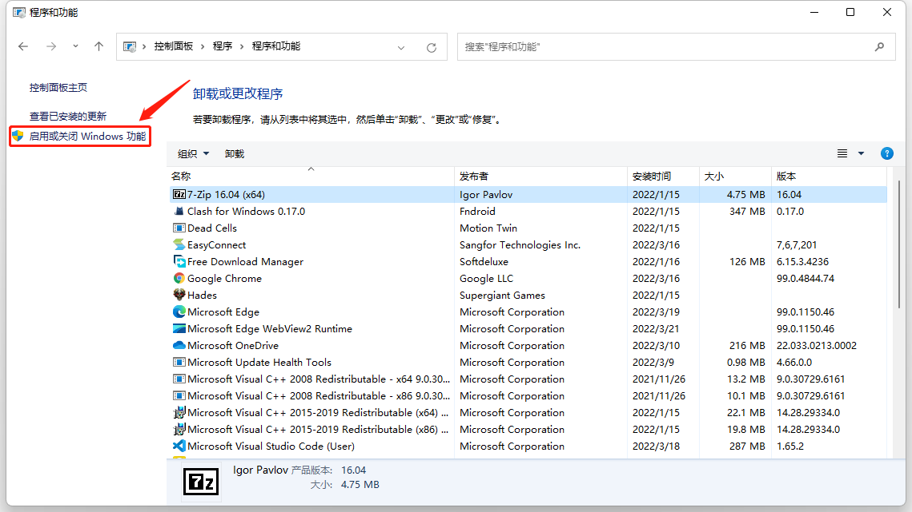
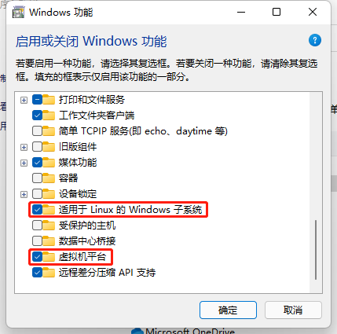
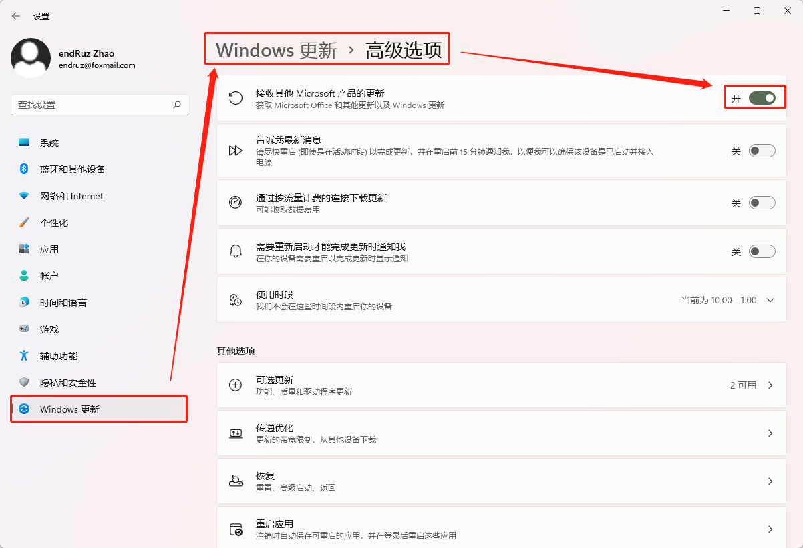

# WSL 安装和卸载

- [WSL 安装和卸载](#wsl-安装和卸载)
  - [安装 WSL](#安装-wsl)
    - [启用 WSL 服务](#启用-wsl-服务)
    - [更新设置 WSL](#更新设置-wsl)
    - [安装 WSL 发行版](#安装-wsl-发行版)
    - [安装 GUI 程序测试 WSLg](#安装-gui-程序测试-wslg)
  - [卸载 WSL](#卸载-wsl)
    - [停止 WSL 服务](#停止-wsl-服务)
    - [卸载发行版、内核更新和其余组件](#卸载发行版内核更新和其余组件)
    - [关闭 WSL 服务](#关闭-wsl-服务)
  - [设置 WSL](#设置-wsl)
    - [设置 Windows Terminal 中 WSL 默认打开路径](#设置-windows-terminal-中-wsl-默认打开路径)

## 安装 WSL

### 启用 WSL 服务

打开 `控制面板-程序-程序和功能` 点击窗口左侧的 `启动或关闭 Windows 功能` 打开 Windows功能 窗口。



勾选 `适用于 Linux 的 Windows 子系统` 和 `虚拟机平台` 选项，点击确认。



之后重启系统使服务生效。

### 更新设置 WSL

使用管理员权限打开 `Windows Terminal` 的 `命令提示符` 或者 `Windows PowerShell` 运行以下命令。

```powershell
# 设置 WSL 的版本为 WSL2
wsl --set-default-version 2
# 更新 WSL，内核更新、安装 WSLg 等
# 更新完后需要重启 WSL 才会生效，可运行以下命令重启 wsl --shutdown
wsl --update
```

若更新时提示以下信息，

```powershell
PS C:\Users\endRuz> wsl --update
正在检查更新...
适用于 Linux 的 Windows 子系统内核可以使用“wsl --update”手动更新，但由于你的系统设置，无法进行自动更新。
 若要接收自动内核更新，请启用 Windows 更新设置:“在更新 Windows 时接收其他 Microsoft 产品的更新”。
 有关详细信息，请访问https://aka.ms/wsl2kernel。
```

则需要打开 `接受其他 Microsoft 产品的更新` 选项。



### 安装 WSL 发行版

WSL 发行版安装命令如下：

```powershell
# 查看可安装的发行版
wsl --list --online
# 安装 Ubuntu-20.04
wsl --install -d Ubuntu-20.04
```

安装完毕后会弹出新的命令行窗口来设置 Linux 用户和密码，之后重新打开 `Windows Terminal` 就可以看到所安装的 Linux 发行版。

> PS：除了命令行方式还可通过 Windows Store 来安装发行版。

### 安装 GUI 程序测试 WSLg

在 WSL 下安装 gedit：

```bash
sudo apt update
sudo apt upgrade
sudo apt install gedit
```

安装完毕后直接输入 `gedit` 命令看是否有窗口弹出，若有则说明 WSLg 正常。

## 卸载 WSL

### 停止 WSL 服务

打开 `Windows Terminal` 的 `命令提示符` 或者 `Windows PowerShell` 运行命令 `wsl.exe --shutdown` 来停止 WSL 服务。

### 卸载发行版、内核更新和其余组件

打开 `控制面板-程序-程序和功能` 选择你所安装的 Linux 发行版、`Windows Subsystem for Linux Update` 和 `Windows Subsystem for Linux WSLg Preview` 等组件进行卸载。

### 关闭 WSL 服务

点击 程序和功能 窗口左侧的 `启动或关闭 Windows 功能` 打开 Windows功能 窗口。


清除 `适用于 Linux 的 Windows 子系统` 和 `虚拟机平台` 选项，点击确认。


之后重启系统，WSL 将从 Windows 中卸载。

## 设置 WSL

### 设置 Windows Terminal 中 WSL 默认打开路径

打开 `Windows Terminal` 设置，选择 Linux 发行版，修改启动目录（startingDirectory）。

其默认值为 `%USERPROFILE%` 是 Windows 下的当前用户目录。

若要将其设置为 Linux 下的家目录 `~`，则需要修改为 `\\wsl.localhost\Ubuntu-20.04\home\endruz`。

其中 `Ubuntu-20.04` 为 Linux 发行版，`\home\endruz` 为 Linux 下的系统路径。需按照实际情况进行设置。

该设置意为启动目录为 Ubuntu-20.04 发行版下用户 `endruz` 的家目录。

参考官方文档：[Windows Terminal 启动目录](https://docs.microsoft.com/zh-cn/windows/terminal/customize-settings/profile-general#starting-directory)
