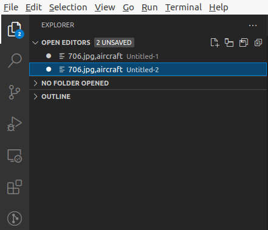
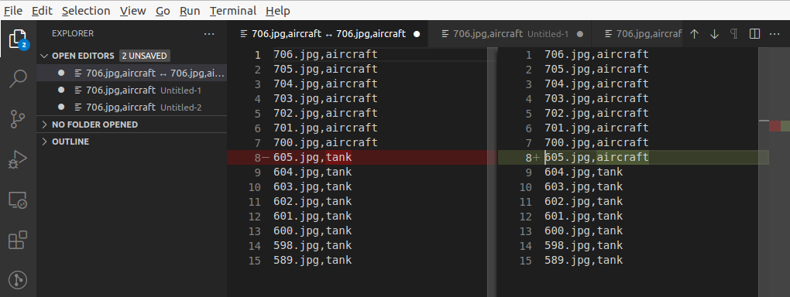

# 文件对比

- [文件对比](#文件对比)
  - [1. 打开文件栏](#1-打开文件栏)
  - [2. 选择待对比文件](#2-选择待对比文件)
  - [3. 选择对比文件](#3-选择对比文件)
  - [4. 显示对比结果](#4-显示对比结果)

## 1. 打开文件栏

## 2. 选择待对比文件

在文件栏中右击待对比文件，选择 `Select for Compare`

## 3. 选择对比文件

在文件栏中右击对比文件，选择 `Compare with Selected`

## 4. 显示对比结果

