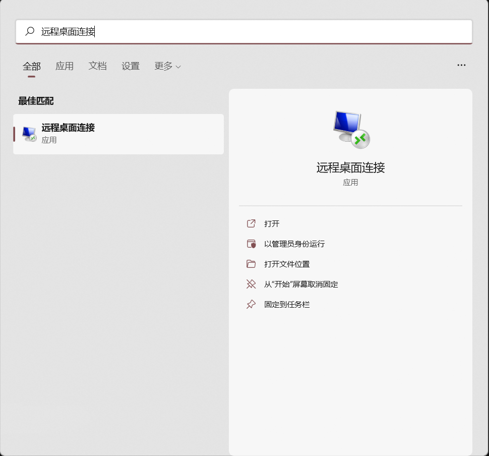
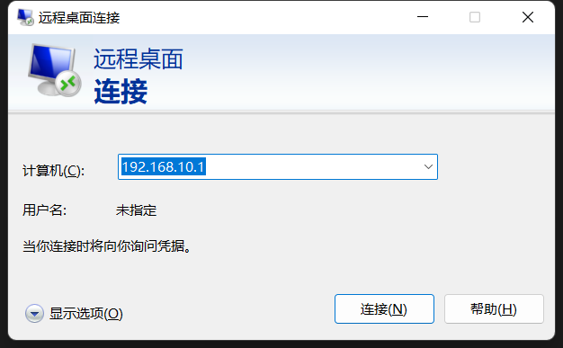
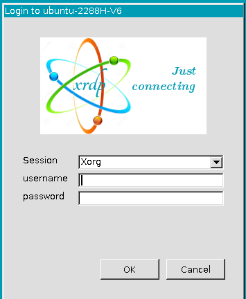
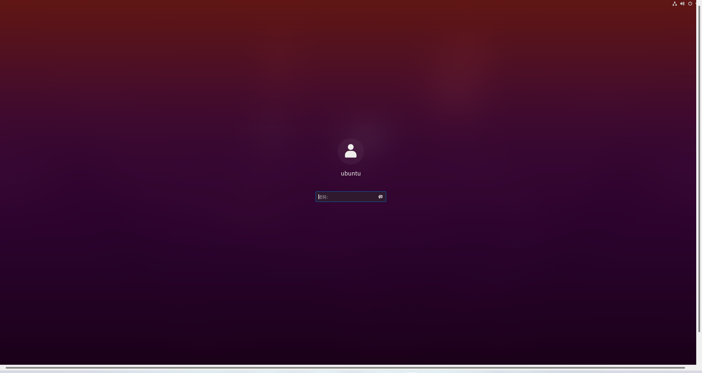

# 使用 Windows 远程桌面连接 Ubuntu

- [使用 Windows 远程桌面连接 Ubuntu](#使用-windows-远程桌面连接-ubuntu)
  - [系统版本](#系统版本)
  - [Ubuntu 侧操作](#ubuntu-侧操作)
  - [Windows 侧操作](#windows-侧操作)

## 系统版本

- Windows 11 Pro
- Ubuntu 20.04 LTS

## Ubuntu 侧操作

1. 查看是否安装图形界面

    ```bash
    # 以 Gnome 为例，若无返回则说明没有安装 Gnome 桌面
    dpkg -l | grep -i ubuntu-desktop
    ```

2. 安装 xrdp

    ```bash
    # 安装 xrdp
    sudo apt install xrdp
    # 设置 xrdp 开机自启
    systemctl enable xrdp
    # 默认情况下 xrdp 使用 /etc/ssl/private/ssl-cert-snakeoil.key，仅对 ssl-cert 用户组成语可读
    # 将 xrdp 用户添加进 ssl-cert 组，避免出现访问出错的问题
    sudo adduser xrdp ssl-cert
    ```

3. 编辑文件 `/etc/xrdp/startwm.sh`

    > Tips: 若未设置会出现连接后黑屏的现象。

    ```bash
    # 编辑文件
    sudo vim /etc/xrdp/startwm.sh
    # 编辑后重启 xrdp 服务
    sudo systemctl restart xrdp
    ```

    文件改动内容如下：

    ```diff
    #!/bin/sh
    # xrdp X session start script (c) 2015, 2017 mirabilos
    # published under The MirOS Licence

    if test -r /etc/profile; then
            . /etc/profile
    fi

    if test -r /etc/default/locale; then
            . /etc/default/locale
            test -z "${LANG+x}" || export LANG
            test -z "${LANGUAGE+x}" || export LANGUAGE
            test -z "${LC_ADDRESS+x}" || export LC_ADDRESS
            test -z "${LC_ALL+x}" || export LC_ALL
            test -z "${LC_COLLATE+x}" || export LC_COLLATE
            test -z "${LC_CTYPE+x}" || export LC_CTYPE
            test -z "${LC_IDENTIFICATION+x}" || export LC_IDENTIFICATION
            test -z "${LC_MEASUREMENT+x}" || export LC_MEASUREMENT
            test -z "${LC_MESSAGES+x}" || export LC_MESSAGES
            test -z "${LC_MONETARY+x}" || export LC_MONETARY
            test -z "${LC_NAME+x}" || export LC_NAME
            test -z "${LC_NUMERIC+x}" || export LC_NUMERIC
            test -z "${LC_PAPER+x}" || export LC_PAPER
            test -z "${LC_TELEPHONE+x}" || export LC_TELEPHONE
            test -z "${LC_TIME+x}" || export LC_TIME
            test -z "${LOCPATH+x}" || export LOCPATH
    fi

    if test -r /etc/profile; then
            . /etc/profile
    fi

    + gnome-session
    + . /etc/X11/Xsession

    test -x /etc/X11/Xsession && exec /etc/X11/Xsession
    exec /bin/sh /etc/X11/Xsession
   ```

4. 重启服务器

    ```bash
    sudo reboot
    ```

## Windows 侧操作

1. 打开 Windows 自带的远程桌面连接工具

    

2. 输入要远程登录的 PC 的主机名或者 IP

    

3. 输入在 Ubuntu 侧的用户名和密码，即可成功远程桌面连接

    

    
