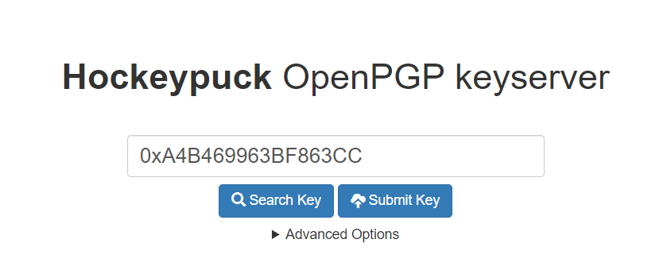
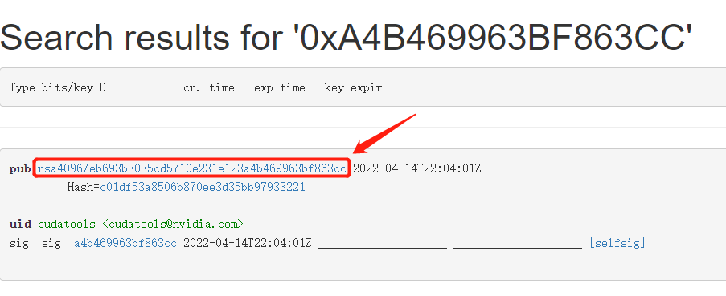
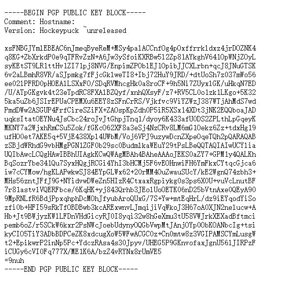

# 修复 Ubuntu 丢失的 GPG 密钥

- [修复 Ubuntu 丢失的 GPG 密钥](#修复-ubuntu-丢失的-gpg-密钥)
  - [报错](#报错)
  - [在线解决方案](#在线解决方案)
  - [存在防火墙的解决方案](#存在防火墙的解决方案)

## 报错

执行 `sudo apt-get update` 命令时获取报错信息如下：

```bash
Reading package lists... Done
W: GPG error: https://developer.download.nvidia.cn/compute/cuda/repos/ubuntu1804/x86_64  InRelease: The following signatures couldn't be verified because the public key is not available: NO_PUBKEY A4B469963BF863CC
E: The repository 'https://developer.download.nvidia.com/compute/cuda/repos/ubuntu1804/x86_64  InRelease' is not signed.
N: Updating from such a repository can't be done securely, and is therefore disabled by default.
N: See apt-secure(8) manpage for repository creation and user configuration details.
```

## 在线解决方案

在终端中执行以下命令：

```bash
sudo apt-key adv --keyserver keyserver.ubuntu.com --recv-keys <PUBKEY>
```

其中 `<PUBKEY>` 为缺少的存储库密钥，例如 `A4B469963BF863CC`。

然后更新

```bash
sudo apt-get update
```

## 存在防火墙的解决方案

使用 `apt-key` 命令自动下载，可能无法在防火墙后面工作。

在这种情况下，请在 Web 浏览器中打开 [Ubuntu Key Server](http://keyserver.ubuntu.com/) 并搜索字符串 `0x<PUBKEY>`



打开 pub 部分中的链接



将密钥内容另存为文件



然后保存的密钥文件上传服务器，并运行以下命令：

```bash
sudo apt-key add <PUBKEY_FILE>
```

然后更新

```bash
sudo apt-get update
```
