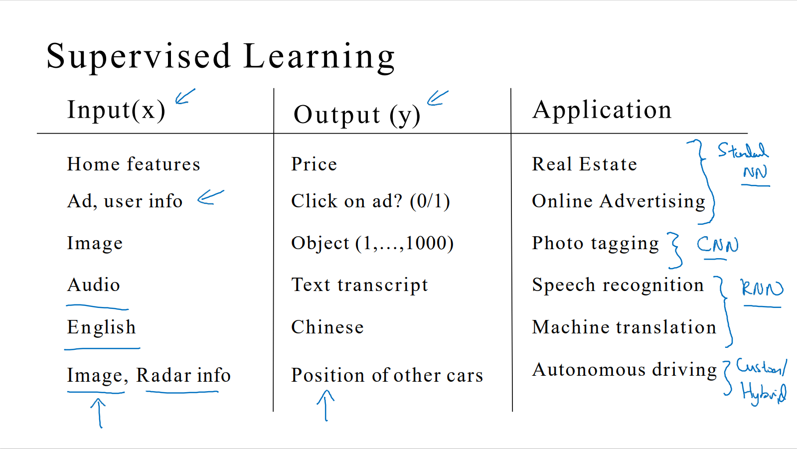
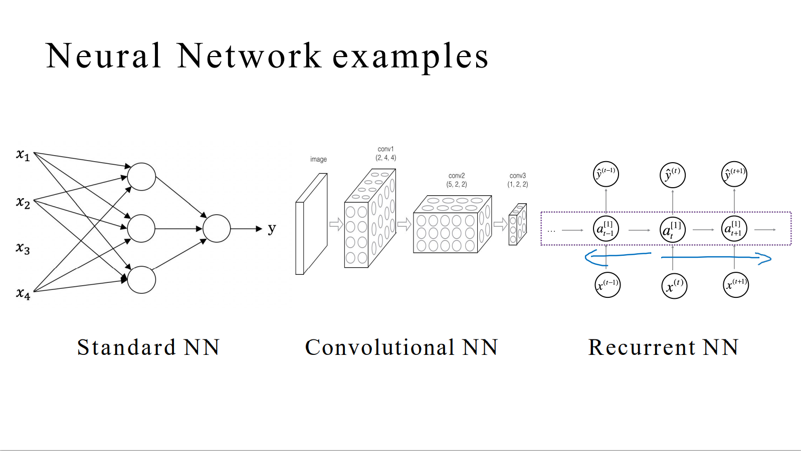
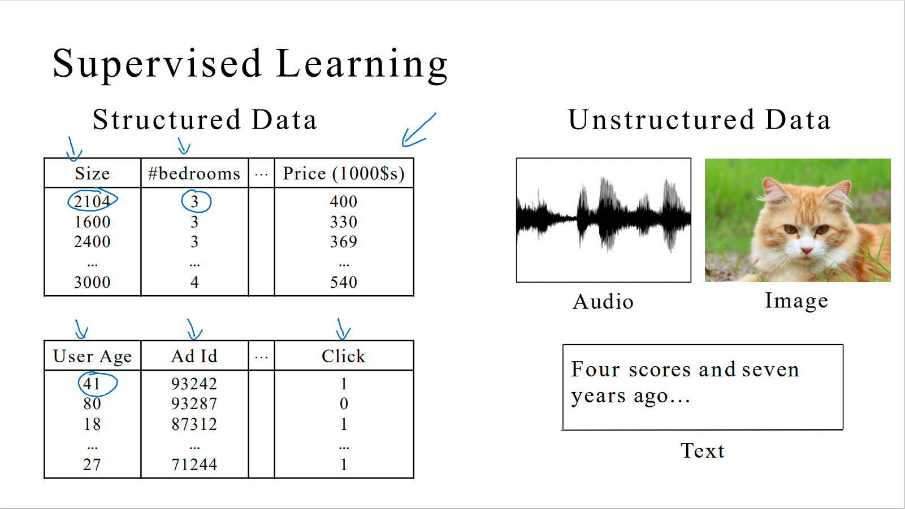

# 监督学习和神经网络

到目前几乎所有由神经网络创造的经济价值，本质上都离不开一种叫做 **监督学习（Supervised Learning）** 的机器学习类别。

在监督学习中，有一些输入 $x$，并且想通过 $x$ 学习到一个函数，这个函数能够将 $x$ 映射到输出 $y$。以下是一些例子：

结构稍有不同的神经网络，在不同应用领域都非常有用：

- 对于房地产和在线广告来说可能是相对的标准一些的神经网络。
- 对于图像应用，我们经常使用 **卷积神经网络（Convolutional Neural Network）**，通常缩写为 **CNN**。
- 对于序列数据，例如音频，文字经常使用 **递归神经网络（Recurrent Neural Network）**，通常缩写为 **RNN**。
- 对于更复杂的应用，比如自动驾驶，若使用图片可能会使用 **CNN**，若使用雷达信息则可能会有一个更定制的，或者一些更复杂的混合的神经网络结构。

以下是一些常见的神经网络结构：

机器学习能够应用在结构化和非结构化数据中。

神经网络的兴起使得我们能够很好的解释非结构化数据，在结构化数据的处理中也有很大的提升。