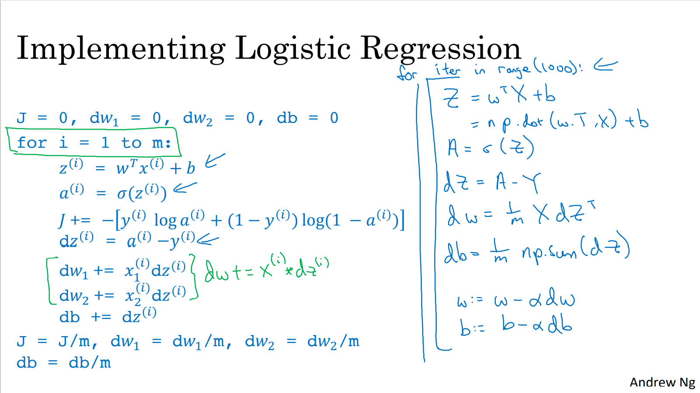

# 向量化逻辑回归的梯度输出

## 公式

根据之前计算所得：

$$
\begin{aligned}
& dz^{(i)} = a^{(i)}-y^{(i)} \\
& dw_{i} = x^{(i)} dz^{(i)} \\
& db_{i} = dz^{(i)}
\end{aligned}
$$

## 非向量化

$$
\begin{aligned}
& dz^{(1)} = a^{(1)}-y^{(1)}, dz^{(2)} = a^{(2)}-y^{(2)}, \cdots , dz^{(m)} = a^{(m)}-y^{(m)} \\
& \\
& dw = 0 \\
& dw += x^{(1)}dz^{(1)} \\
& dw += x^{(2)}dz^{(2)} \\
& \cdots \\
& dw += x^{(m)}dz^{(m)} \\
& dw /= m \\
& \\
& db = 0 \\
& db += dz^{(1)} \\
& db += dz^{(2)} \\
& \cdots \\
& db += dz^{(m)} \\
& db /= m
\end{aligned}
$$

## 向量化

$$
\begin{aligned}
& dZ = [dz^{(1)}, dz^{(2)}, \cdots , dz^{(m)}] = [a^{(1)} - y^{(1)}, a^{(2)} - y^{(2)}, \cdots, a^{(m)} - y^{(m)}]\\
& A = [a^{(1)}, a^{(2)}, \cdots, a^{(m)}] \\
& Y = [y^{(1)}, y^{(2)}, \cdots, y^{(m)}] \\
& dZ = A - Y \\
& db = \frac{1}{m} \sum_{i=1}^{m} dz^{(i)} = \frac{1}{m} np.sum(dz)\\
& dw = \frac{1}{m}Xdz^{T} \\
\end{aligned}
$$

