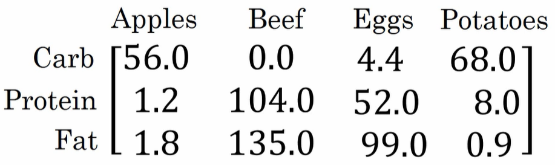

# Python 中的广播

- [Python 中的广播](#python-中的广播)
  - [矩阵计算](#矩阵计算)
  - [广播的例子](#广播的例子)
  - [numpy 的广播机制](#numpy-的广播机制)
    - [维度](#维度)
    - [广播（broadcasting)](#广播broadcasting)
    - [广播的规则](#广播的规则)

## 矩阵计算

这是一个不同食物（每 100g）中不同营养成分的卡路里含量表格，表格为 3 行 4 列。

列表示不同的食物种类，从左至右依次为苹果，牛肉，鸡蛋，土豆。

行表示不同的营养成分，从上到下依次为碳水化合物，蛋白质，脂肪。



那么，我们现在想要不使用 for 循环，即使用向量化，计算不同食物中不同营养成分中的卡路里百分比。

```python
import numpy as np

A = np.array([[56.0, 0.0,   4.4,  68.0],
              [1.2,  104.0, 52.0, 8.0],
              [1.8,  135.0, 99.0, 0.9]])
print(A)
# [[ 56.    0.    4.4  68. ]
#  [  1.2 104.   52.    8. ]
#  [  1.8 135.   99.    0.9]]

# axis 用来指明将要进行的运算是沿着哪个轴执行
# 在 numpy 中，0 轴是垂直的，也就是列，而 1 轴是水平的，也就是行。
cal = A.sum(axis=0)
print(cal)
# [ 59.  239.  155.4  76.9]

# 因为 cal 本身就是 1x4 的矩阵，不再需要 reshape 成 1x4 了
# 但是当我们写代码时不确定矩阵维度的时候，通常会对矩阵进行重塑来确保得到我们想要的列向量或行向量。
# 重塑操作 reshape 是一个常量时间的操作，时间复杂度是 O(1)，它的调用代价极低。
# percentage = 100 * A / cal.reshape(1, 4)
percentage = 100 * A / cal
print(percentage)
# [[94.91525424  0.          2.83140283 88.42652796]
#  [ 2.03389831 43.51464435 33.46203346 10.40312094]
#  [ 3.05084746 56.48535565 63.70656371  1.17035111]]
```

代码中 `percentage = 100 * A / cal` 这一行。

$A$ 为 $3\times4$ 的矩阵，常数 $100$ 乘 $A$ 得到的还是 $3\times4$ 的矩阵。

> 注：矩阵乘以一个常数，就是所有位置都乘以这个数。
> $$2 \times \begin{bmatrix} 1&2\\ 3&4 \end{bmatrix} = \begin{bmatrix} 2&4\\ 6&8 \end{bmatrix}$$

$3\times4$ 的矩阵需要和 $cal$，$1 \times 4$ 的矩阵，做除法。使用了 numpy 中的广播机制。

## 广播的例子

在 numpy 中，当一个 $4 \times 1$ 的列向量与一个常数做加法时，实际上会将常数扩展为一个 $4 \times 1$ 的列向量，然后两者做逐元素加法。结果就是右边的这个向量。这种广播机制对于行向量和列向量均可以使用。

$$
\begin{bmatrix}
1 \\
2 \\
3 \\
4 \\
\end{bmatrix}

+ 100 =

\begin{bmatrix}
1 \\
2 \\
3 \\
4 \\
\end{bmatrix}

+

\begin{bmatrix}
100 \\
100 \\
100 \\
100 \\
\end{bmatrix}

=

\begin{bmatrix}
101 \\
102 \\
103 \\
104 \\
\end{bmatrix}

$$

用一个 $2 \times 3$ 的矩阵和一个 $1 \times 3$ 的矩阵相加，其泛化形式是 $m \times n$ 的矩阵和 $1 \times n$ 的矩阵相加。在执行加法操作时，其实是将 $1 \times n$ 的矩阵复制成为 $m \times n$ 的矩阵，然后两者做逐元素加法得到结果。针对这个具体例子，相当于在矩阵的第一列加 100，第二列加 200，第三列加 300。这就是在前一张幻灯片中计算卡路里百分比的广播机制，只不过这里是除法操作（广播机制与执行的运算种类无关）。

$$
\begin{bmatrix}
1 & 2 & 3 \\
4 & 5 & 6 \\
\end{bmatrix}

+

\begin{bmatrix}
100 & 200 & 300 \\
\end{bmatrix}

=

\begin{bmatrix}
1 & 2 & 3 \\
4 & 5 & 6 \\
\end{bmatrix}

+

\begin{bmatrix}
100 & 200 & 300 \\
100 & 200 & 300 \\
\end{bmatrix}

=

\begin{bmatrix}
101 & 202 & 303 \\
104 & 205 & 306 \\
\end{bmatrix}
$$

这里相当于是一个 $m \times n$ 的矩阵加上一个 $m \times 1$ 的矩阵。在进行运算时，会先将 $m \times 1$ 矩阵水平复制 $n$ 次，变成一个 $m \times n$ 的矩阵，然后再执行逐元素加法。

$$
\begin{bmatrix}
1 & 2 & 3 \\
4 & 5 & 6 \\
\end{bmatrix}

+

\begin{bmatrix}
100 \\
200 \\
\end{bmatrix}

=

\begin{bmatrix}
1 & 2 & 3 \\
4 & 5 & 6 \\
\end{bmatrix}

+

\begin{bmatrix}
100 & 100 & 100 \\
200 & 200 & 200 \\
\end{bmatrix}

=

\begin{bmatrix}
101 & 102 & 103 \\
204 & 205 & 206 \\
\end{bmatrix}
$$

## numpy 的广播机制

### 维度

首先介绍下什么是维度数量，什么是维度大小。

```python
A = np.zeros((2,3,4))
print(A)
# [[[0. 0. 0. 0.]
#   [0. 0. 0. 0.]
#   [0. 0. 0. 0.]]

#  [[0. 0. 0. 0.]
#   [0. 0. 0. 0.]
#   [0. 0. 0. 0.]]]
print(A.shape)
# (2,3,4)
```

numpy 中指定维度都是用元组来的，比如 `np.zeros((2,3,4))` 的维度数量是三维的。

这个数组第一维的维度大小是 2，第二维的维度大小是 3，第三维的维度大小是 4。

### 广播（broadcasting)

通常只在对多个数组进行对应元素操作形状不同时，才会发生广播。

那什么是对应元素进行操作呢？比如：

```python
A = np.array([[1,2,3], [3,2,1]])
B = np.array([[2,2,2], [2,2,2]])
print(A * B)
# [[2 4 6]
#  [6 4 2]]
```

> 注：`A` 和 `B` 都是 numpy 中 的数组对象，`A * B` 表示对应元素相乘，相当于 `np.multiply(A, B)`。
>
> 又因为 `A` 和 `B` 的秩都不为 1，所以 `np.dot(A, B)` 表示矩阵相乘。


什么叫做形状不同呢？

```python
A = np.array([[1,2,3], [3,2,1]])
B = 2
print(A * B)
# [[2 4 6]
#  [6 4 2]]
```

`A` 是二维向量，`B` 是标量，这就是形状不同。

两个例子输入不同但运行结果相同的原因就是发生的广播。

`B` 被填充为 `[[2,2,2], [2,2,2]]`，然后 `A * B` 的效果变成了，`[[1,2,3], [3,2,1]] * [[2,2,2], [2,2,2]]`。

### 广播的规则

当对两个数组进行操作时，numpy 会逐元素比较它们的形状。它从后缘（即最右边）维度开始，然后向左比较。两个维度兼容时有两种情况：

1. 维度大小相等
2. 其中一个维度大小是 1

如果对于以上的解释依然没有理解，可以尝试阅读[官方文档](https://numpy.org/doc/stable/user/basics.broadcasting.html#basics-broadcasting)中的说明。
