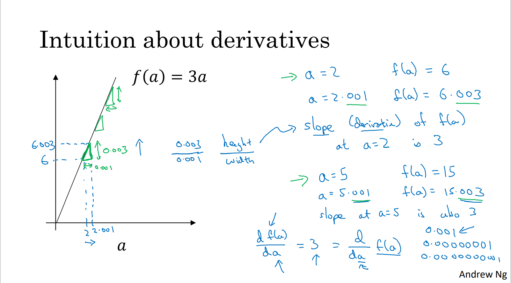

# 导数

**导函数**，如果函数 $y=f(x)$ 在开区间内每一点都可导，就称函数 $f(x)$ 在区间内可导。这时函数 $y=f(x)$ 对于区间内的每一个确定的 $x$ 值，都对应着一个确定的导数值，这就构成一个新的函数，称这个函数为原来函数 $y=f(x)$ 的导函数，记作 $y'$、$f'(x)$、$\frac{dy}{dx}$ 或 $\frac{df(x)}{dx}$，简称**导数**。

导数公式：

| 函数              | 导函数                   |
| :---------------- | :----------------------- |
| $y = c$           | $y'=0$                   |
| $y = x$           | $y'=1$                   |
| $y = x^{n}$       | $y'=nx^{n-1}$            |
| $y = a^x$         | $y'=a^x\ln{a}$           |
| $y = \log_{a}{x}$ | $y'=\frac{\log_{a}e}{x}$ |
