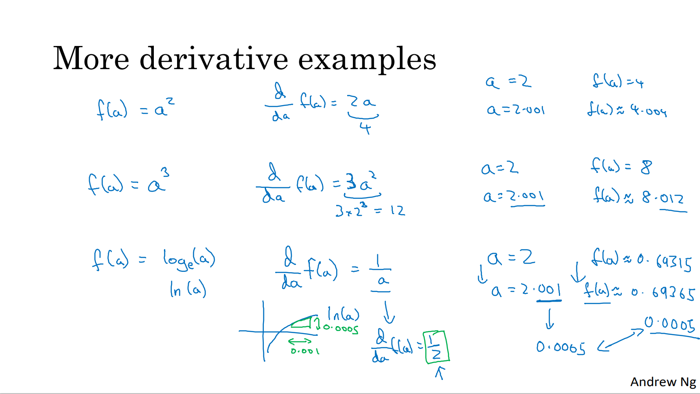

# 更多导数示例

在这个视频中，你只需要记住两点：

1. 导数就是斜率，而函数的斜率，在不同的点是不同的。在第一个例子中 $f(a)=3a$ ，这是一条直线，在任何点它的斜率都是相同的，均为 $3$。但是对于函数 $f(a)=a^2$，或者 $f(a)=\log{a}$，它们的斜率是变化的，所以它们的导数或者斜率，在曲线上不同的点处是不同的。
2. 如果你想知道一个函数的导数，你可参考你的微积分课本或者维基百科，然后你应该就能找到这些函数的导数公式。
