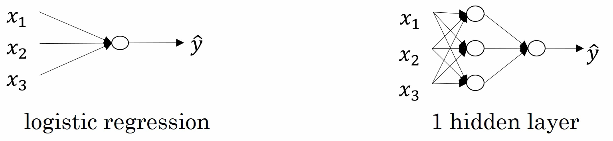

# 深L层神经网络

- [深L层神经网络](#深l层神经网络)
  - [神经网络的层数定义](#神经网络的层数定义)
  - [深度学习的符号定义](#深度学习的符号定义)

## 神经网络的层数定义

之前学习的逻辑回归和浅层神经网络（一个隐藏层的神经网络）结构如下：

神经网络的层数定义：从左到右，由 0 开始定义。

逻辑回归也是一个一层的神经网络，有一个隐藏层的神经网络就是一个两层神经网络。

当我们算神经网络的层数时，我们不算输入层，我们只算隐藏层和输出层。

## 深度学习的符号定义

上图是一个四层的神经网络，有三个隐藏层。我们可以看到，第一层（即左边数过去第二层，因为输入层是第 0 层）有 5 个神经元数目，第二层 5 个，第三层 3 个。

用 $L$ 表示层数，上图中 $L = 4$，输入层的索引为 0，第一个隐藏层 $n^{[1]} = 5$，表示有五个隐藏神经元，同理 $n^{[2]} = 5$，$n^{[3]} = 3$，$n^{[4]} = n^{[L]} = 1$（输出单元为 1）。而输入层，$n^{[0]} = n_{x} = 3$。

在不同层所拥有的神经元的数目，对于每层 $l$ 都用 $a^{[l]}$ 来记作 $l$ 层激活后结果，我们会在后面看到在正向传播时，最终能你会计算出 $a^{[l]}$。

通过用激活函数 $g$ 计算 $z^{[l]}$，激活函数也被索引为层数 $l$，然后我们用 $w^{[l]}$ 来记作在 $l$ 层计算 $z^{[l]}$ 值的权重。类似的，$z^{[l]}$ 里的方程 $b^{[l]}$ 也一样。

最后总结下符号约定：

输入的特征记作 $x$，但是 $x$ 同样也是 0 层的激活函数，所以 $x = a^{[0]}$。

$a^{[L]}$ 是最后一层的激活函数，所以 $a^{[L]}$ 是等于这个神经网络所预测的输出结果。
