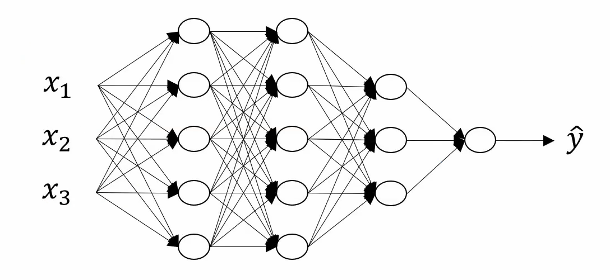

# 深层网络中的正向传播

- [深层网络中的正向传播](#深层网络中的正向传播)
  - [单样本](#单样本)
  - [向量化](#向量化)

## 单样本

单独训练样本 $x$ 的正向传播

$$
\begin{aligned}
x &= a^{[0]}
\\
z^{[1]} &= w^{[1]}a^{[0]} + b^{[1]}
\\
a^{[1]} &= g^{[1]}(z^{[1]})
\\
z^{[2]} &= w^{[2]}a^{[1]} + b^{[2]}
\\
a^{[2]} &= g^{[2]}(z^{[2]})
\\
&\cdots
\\
z^{[4]} &= w^{[4]}a^{[3]} + b^{[4]}
\\
a^{[4]} &= g^{[4]}(z^{[4]}) = \hat{y}
\end{aligned}
$$

可以推导得

$$
\begin{aligned}
z^{[l]} &= w^{[l]}a^{[l-1]} + b^{[l]}
\\
a^{[l]} &= g^{[l]}(z^{[l]})
\end{aligned}
$$

## 向量化

$$
\begin{aligned}
X &= A^{[0]}
\\
Z^{[1]} &= W^{[1]}A^{[0]} + b^{[1]}
\\
A^{[1]} &= g^{[1]}(Z^{[1]})
\\
Z^{[2]} &= W^{[2]}A^{[1]} + b^{[2]}
\\
A^{[2]} &= g^{[2]}(Z^{[2]})
\\
&\cdots
\\
Z^{[4]} &= W^{[4]}A^{[3]} + b^{[4]}
\\
A^{[4]} &= g^{[4]}(Z^{[4]}) = \hat{Y}
\end{aligned}
$$

可以推导得

$$
\begin{aligned}
Z^{[l]} &= W^{[l]}A^{[l-1]} + b^{[l]}
\\
A^{[l]} &= g^{[l]}(Z^{[l]})
\end{aligned}
$$

这里只能用一个显式 for 循环，从 1 到 $L$，然后一层接着一层去计算。
