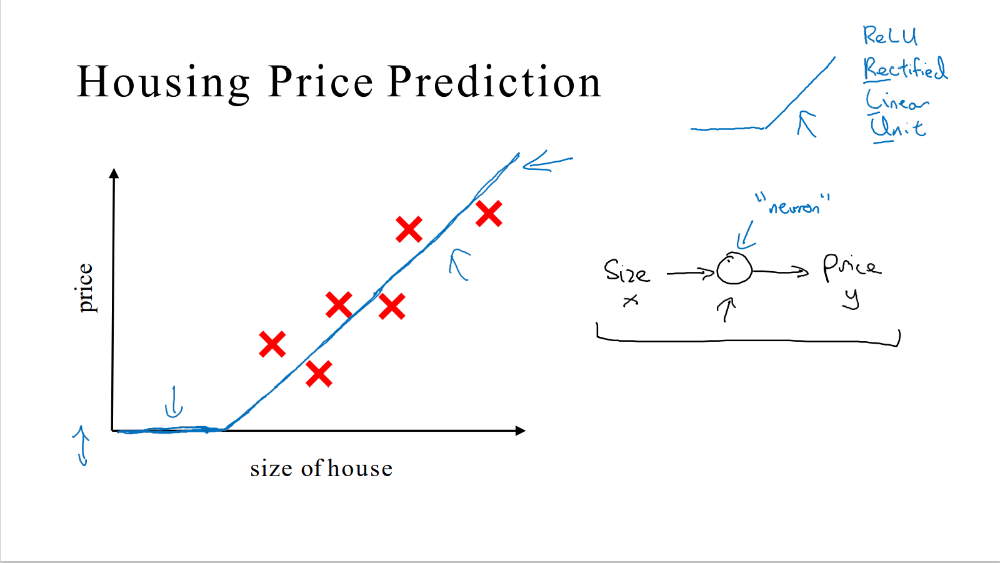
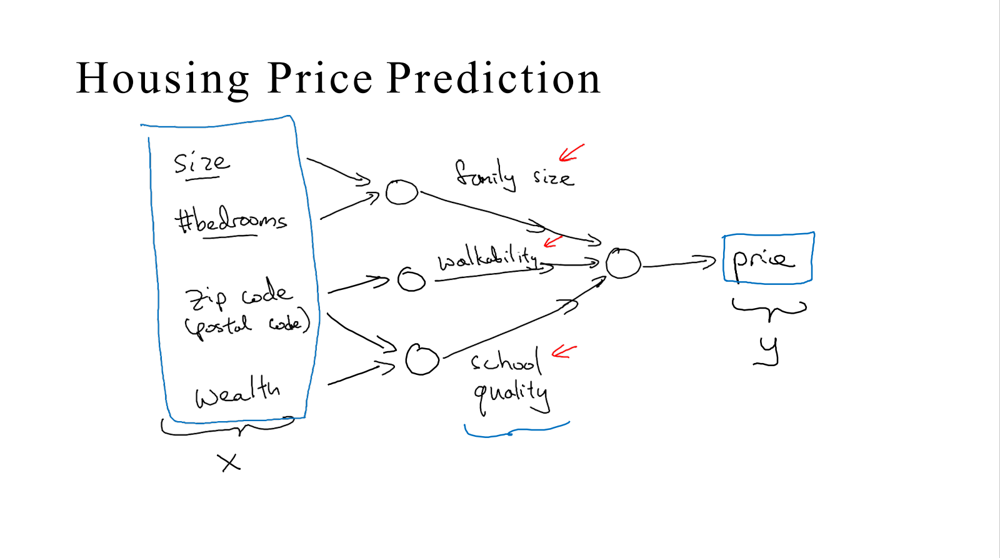
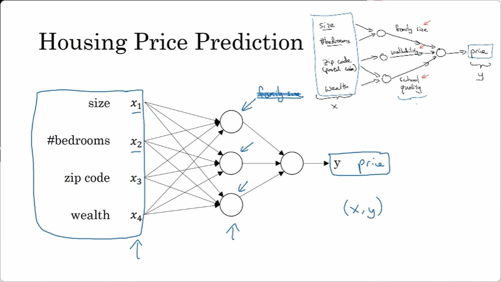

# 什么是神经网络

- [什么是神经网络](#什么是神经网络)
  - [神经元](#神经元)
  - [神经网络](#神经网络)

深度学习一般指的是训练神经网络，有时是非常大（深）的神经网络。

## 神经元

由房价预测的例子开始说起。假设有一个数据集知道房屋的面积和价格，来拟合一个根据房屋面积预测房价的函数。已知价格永远不为负数，于是得到以下这个函数。

这是一个最简单的神经网络，把房屋的面积作为神经网络的输入（用 $x$ 表示），通过一个节点（一个单独的神经元），最终输出了价格（用 $y$ 表示）。

在有关神经网络的文献中，可以经常看得到这个函数。从趋近于零开始，然后变成一条直线。这个函数被称作 **ReLU** 激活函数，它的全称是 **Rectified Linear Unit（修正线性单元）** 。rectify 可以理解成 $max(0, x)$ ，这也是你得到一个这种形状的函数的原因。

## 神经网络

如果把神经元想象成单独的乐高积木，那么可以通过搭积木来完成一个更大的神经网络。

当有一些其他的房屋特征来预测房屋的价格，我们可以获得如下的关系：

基于房屋面积和卧室数量，可以估算家庭人口，基于邮编，可以估测步行化程度或者学校的质量。

以此为例，$x$ 是所有的这四个输入，$y$ 是预测的价格，把这些单个的神经元叠加在一起，我们就有了一个稍微大一点的神经网络。

当实现（搭建）神经网络时，只要给定一个足够多的训练实例 $(x, y)$，神经网络就能很好的拟合出一个函数来建立 $x$ 和 $y$ 之间的映射关系。

其中，$x_{1} \cdots x_{4}$ 这一层一般称为**输入层**，之后的一层中每一个神经元都与上一层的所有结点相连（用来把前边提取到的特征综合起来）叫做**全连接层**。
