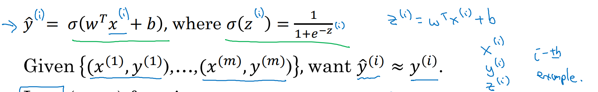
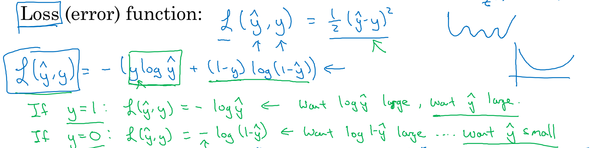
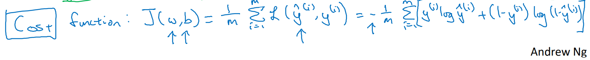

# 逻辑回归的代价函数

- [逻辑回归的代价函数](#逻辑回归的代价函数)
  - [损失函数](#损失函数)
  - [代价函数](#代价函数)

为了优化逻辑回归模型的参数 $w$ 和 $b$ 需要定义一个 **代价函数（Cost Function）**。

## 损失函数

**损失函数（Loss Function）** 又叫做 **误差函数（Error Function）**，记作 $L(\hat{y}, y)$，来衡量预测结果与真实值之间的误差。

一般我们用平方差来作为损失函数：

$$L(\hat{y}, y) = \frac{1}{2}(\hat{y} - y) ^ 2$$

但是通常在逻辑回归中不会使用，因为当我们在学习逻辑回归参数的时候，会发现我们的优化目标不是凸优化，只能找到多个局部最优值，梯度下降法很可能找不到全局最优值。

在逻辑回归中用到的损失函数是：

$$L(\hat{y}, y) = - (y \log(\hat{y}) + (1 - y) \log(1 - \hat{y}))$$

对逻辑回归损失函数，我们也想让它尽可能地小。

在这门课中有很多的函数效果和现在这个类似，就是如果 $y$ 等于 $1$，我们就尽可能让 $\hat{y}$ 变大，如果 $y$ 等于 $0$，我们就尽可能让 $\hat{y}$ 变小。 

## 代价函数

损失函数是在单个训练样本中定义的，它衡量的是算法在单个训练样本中表现如何，为了衡量算法在全部训练样本上的表现如何，我们需要定义一个算法的代价函数。算法的代价函数是对个样本的损失函数求和然后除以 $m$:

$$J(w, b) = \frac{1}{m} \sum_{i=1}^{m} L(\hat{y}^{(i)}, y^{(i)}) = - \frac{1}{m} \sum_{i=1}^{m} (y^{(i)} \log(\hat{y}^{(i)}) + (1 - y^{(i)}) \log(1 - \hat{y}^{(i)}))$$

